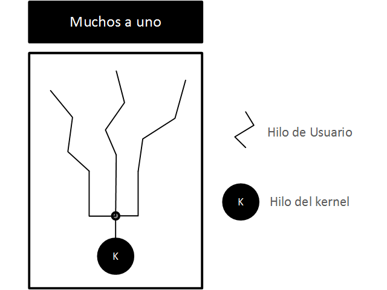
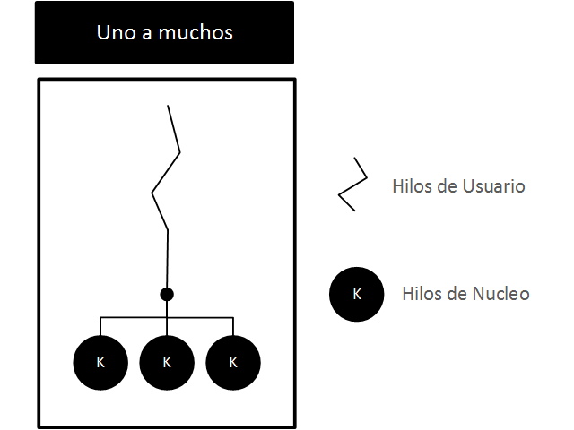

Procesos
========

Recopilado por:

Gestión de Procesos
-------------------

Conceptos Generales
~~~~~~~~~~~~~~~~~~~

Un "programa" se define como un compuesto secuencial de órdenes que
puede interpretar un mecanismo. Un "proceso" se define como una
agrupación de acciones aplicadas a una entidad para modificarla, en
nuestro caso lo analizaremos como un programa en ejecución que sufre
varias modificaciones.

El elemento esencial de un sistema operativo es el que se ocupa de
administrar los procesos, dado que pueden surgir diferentes escenarios
como por ejemplo que distintos procesos deban iniciar el envío de un
correo electrónico a través de la misma aplicación de *Outlook* de
Microsoft

Elementos de un proceso
~~~~~~~~~~~~~~~~~~~~~~~

Durante la ejecución de un programa, un proceso constantemente cambia
los valores de los diferentes elementos involucrados, tanto así que el
sistema operativo almacena diferentes datos sobre un momento dado en que
se encuentra un proceso. El encargado de esta acción es el bloque de
control de proceso. En la imagen de memoria se encuentran el código y
los datos de un proceso.

Clasificación de sistema operativos según los procesos
~~~~~~~~~~~~~~~~~~~~~~~~~~~~~~~~~~~~~~~~~~~~~~~~~~~~~~

Los sistemas operativos se pueden clasificar según el número de procesos
y usuarios: - Monotarea ó Monoproceso: existe un sólo proceso en un
determinado momento. - Multitarea ó Multiproceso: existen varios
procesos en un determinado momento. - Monousuario: permite un sólo
usuario a la vez. - Multiusuario ó Tiempo Compartido: permite varios
usuarios simultáneos ejecutando múltiples tareas.

Manipulación sobre un proceso
~~~~~~~~~~~~~~~~~~~~~~~~~~~~~

El sistema operativo nos permite manejar a los procesos por medio de las
siguientes esenciales operaciones:

-  Crear un proceso: derivado de un proceso padre (ej. UNIX) o de la
   acción de abrir un archivo ejecutable (ej. WINDOS).
-  Ejecutar un proceso: existen dos maneras de ejecución. *Batch* no
   está asociado a una estación y su entrada y salida de datos son
   proporcionados por un archivo. La otra manera *Interactiva* está
   asociado a una estación y su entrada depende un usuario y salida es
   desplegada a éste.
-  Terminar un proceso: un proceso puede finalizar por tres causas
   posibles. Un programa ha llegado a su final; se generó un error de
   ejecución; otro proceso o el usuario finalizó el proceso.

Analizando los Procesos
-----------------------

Dependencia entre los procesos
~~~~~~~~~~~~~~~~~~~~~~~~~~~~~~

Ciertos sistemas operativos mantienen un orden de dependencia entre
procesos como lo es el caso de UNIX, donde se encuentran diferentes
rangos como Padre, Hijo, Hermano o Abuelo. Además es posible reunir a
varios procesos bajo un esquema de grupos y un entorno específico, para
así poder realizar una manipulación más amplia sobre varios de estos.

Sistemas multiproceso
~~~~~~~~~~~~~~~~~~~~~

Por ser este el sistema más complejo, ahondaremos en sus características
principales, que son: paralelismo real entre procesador y funciones de
entrada y salida; memoria principal apta para guardar varios procesos; y
la capacidad de cambiar entre las funciones de entrada y salida y el
procesamiento.

Procesos Nulos
~~~~~~~~~~~~~~

El procesador nunca se detiene de realizar acciones. Pero realmente
tienen que existir momentos donde el procesador no realiza ningún
trabajo provechoso, de aquí que nacen los *procesos nulos*, que sirven
para distraer al procesador cuando no existe otro trabajo por realizar.

Ventajas de los sistemas multiproceso
~~~~~~~~~~~~~~~~~~~~~~~~~~~~~~~~~~~~~

Entre las ventajas de la utilización de estos sistemas, tenemos:

-  Modularidad. Fracciona la ejecución de una aplicación en varios
   procesos y así favorece la programación.
-  Brinda una útil asistencia de la manera más eficaz, interactiva y
   concurrente a la necesidad de varios usuarios.
-  Explota los períodos de tiempo de procesos nulos para terminar la
   realización de peticiones de funciones de entrada y salida.
-  Incrementa la utilización del CPU puesto que emplea el tiempo muerto
   cuando los procesos están obstruidos.

Grado de multiprogramación
~~~~~~~~~~~~~~~~~~~~~~~~~~

Se entiende por grado de multiprogramación a la cantidad de procesos
vivos que ampara un sistema. Lo que se busca es que a mayor grado de
multiprogramación el sistema realize menos procesos nulos, pero esto
conlleva a que el sistema posee mayores requerimientos de memoria.
Entonces a mayor cantidad de procesos, mayor será el grado de
multiprogramación.

Información de un proceso
-------------------------

Para estudiar un proceso detenidamente, dividiremos las partes de un
proceso en cuatro componentes principales.

Estado de un procesador
~~~~~~~~~~~~~~~~~~~~~~~

El estado de un procesador es conformado y almacenado por todos los
registros de su procesador y el BCP. Cuando un proceso se encuentra en
ejecución, los registros son constantemente actualizados con nuevos
valores para no tener que recurrir a la memoria principal, debido a que
la velocidad de respuesta es cuantiosamente más lenta, pero el BCP no es
actualizado. Es hasta que un proceso se ve interrumpido debido a las
tres causas posibles que delimitamos anteriormente, que entonces el
sistema operativo estable con nuevos datos al BCP, en este caso con los
datos del estado del procesador actual.

Imagen de memoria del proceso
~~~~~~~~~~~~~~~~~~~~~~~~~~~~~

El sistema operativo delimita los campos de memoria que pueden conformar
la imagen de memoria de un proceso. Entre las características más
distinguidas se encuentran las siguientes:

-  La imagen de memoria es el lugar exclusivo para almacenar información
   del proceso, no puede se guardar en direcciones no asignadas, por lo
   que eventualmente se debería de levantar una excepción tras ser
   detectada por el hardware de protección. Y finalmente el sistema
   operativo debería interrumpir dicho proceso.
-  La imagen de memoria apunta a memoria virtual o memoria física, según
   el computador.
-  La imagen de memoria aumenta o disminuye según la asignación dinámica
   de memoria que requieren los procesos.

Información del BCP
~~~~~~~~~~~~~~~~~~~

En este elemento se encuentra la información elemental de un proceso,
como lo son: la información de identificación del proceso y del usuario;
el estado del procesador con los valores originales o los valores en el
momento en que fue interrumpido un proceso. Y finalmente la información
de control del proceso, que contiene el estado del proceso, prioridad
del proceso, información de planificación, evento que está
interrumpiendo este proceso, archivos abiertos, puertos de comunicación
asignados, punteros sobre otros procesos y descripción de la sección de
memoria concedida a un proceso

Tablas del sistema operativo
~~~~~~~~~~~~~~~~~~~~~~~~~~~~

Es imperativo mantener tablas con información que detalla recursos del
sistemas y a los procesos, pero solo cierta información se introduce en
el BCP según la exigencia de compartir la información y la eficiencia.

Por eficiencia, la tabla de procesos es conformada como un esqueleto
estático para que todos los BCPs contengan el mismo tamaño. Y por otro
lado, cuando una información se debe compartir entre distintos procesos,
lo mejor es no incluirla en el BCP, por lo que solamente se almacenarán
punteros hacia esa información.

Formación de un proceso
~~~~~~~~~~~~~~~~~~~~~~~

Para inicializar un proceso se debe rellenar toda la información que
comprende un proceso, para esto el sistema operativo realiza las
siguientes operaciones:

-  Fijar un espacio de memoria virtual conformado por una serie de
   secciones, para alojar la imagen de memoria.
-  Escoger un BCP disponible de la tabla de la procesos.
-  Completar el BCP con toda la información requerida antes mencionada
   como la información de identificación de proceso, con los detalles de
   la memoria concedida, con los valores originales de los registros,
   etc.
-  Introducir las rutinas de sistema y el código en el segmento de texto
-  Introducir los datos preliminares del fichero objeto en el segmento
   de datos
-  Designar la nueva pila a ser utilizada por el proceso con los valores
   del entorno y los parámetros requeridos por el programa.
-  Finalmente, el estado del este proceso pasa a ser *preparado para
   ejecutar*.

Estados de un proceso
---------------------

Los procesos vivos de un sistema multiproceso se pueden encontrar en
cinco fases distintas, de las cuales, las tres siguientes tres primeros
son las elementales.

Ejecución
~~~~~~~~~

En esta fase, el proceso se encuentra en una etapa de procesamiento,
está siendo realizado por el procesador. El estado del proceso habita en
los registros del procesador.

Bloqueado
~~~~~~~~~

En esta fase, el proceso se encuentra interrumpido, a la espera de que
suceda un evento por lo tanto no puede proseguir hasta que este ocurra.
Un ejemplo típico de esta fase es la espera a una petición de la función
de entrada y salida. El estado del proceso habita en el BCP.

Listo
~~~~~

En esta fase, el proceso se encuentra preparado para ejecutar su
procesamiento. El sistema operativo es el encargado de indicar cuál
proceso es el siguiente a pasar a la fase de ejecución en caso de
existir más de un proceso en fase de listo. El estado del proceso habita
en el BCP.

Suspendido
~~~~~~~~~~

Existen otras dos fases, de un proceso. Fase de espera y fase de
suspendido. Es muy usual que exista un repertorio de procesos en espera
para ser consumados a la mayor brevedad.

Para reducir el grado de multiprogramación el sistema operativo recurre
a suspender ciertos procesos, esto con el fin primordial de liberar la
adecuada cantidad de memoria para los procesos que no se encuentran
suspendidos. Mas es de reconocer que esta opción de suspender procesos
no se encuentra disponible en todos los sistemas operativos como el caso
de un sistema monoproceso.

Cambio de contexto
~~~~~~~~~~~~~~~~~~

Se denomina cambio de contexto a la acción de, primero, guardar el
estado de un proceso en su debido BCP y, segundo, a proceder a realizar
la rutina que procesa una interrupción del sistema operativo. Estas dos
acciones pueden posiblemente incurrir en cambiar valores del estado de
otros procesos.

Procesos Ligeros
----------------

Conceptos Generales
~~~~~~~~~~~~~~~~~~~

Se entiende por un proceso ligero a un programa que se encuentra en una
corriente de ejecución y que comparte cierta información y su imagen de
memoria junto a otros procesos ligeros. Un proceso puede contener una
única corriente de ejecución normal o varias corrientes de ejecución
ligeras que ocurren en paralelo simultáneamente.

Un proceso ligero contiene elementos propios a si mismo como lo son los
siguientes principales: el contador de programa, registros, estado del
proceso y pila. Mas, estos procesos ligeros comparten cierta información
en común dado que proviene de un proceso principal. Entre ellos se
encuentran: temporizadores, archivos abiertos, variables globales,
espacio de memoria asignada.

Estados de un proceso ligero
~~~~~~~~~~~~~~~~~~~~~~~~~~~~

Un proceso ligero también puede encontrarse en los tres estados típicos
de en ejecución, preparado y bloqueado. Con la única diferencia de que
el estado general del proceso en si, depende de la composición de todos
sus estados ligeros, al aplicar la función lógica de *AND* u *OR*
dependiendo de la fase en que se encuentre.

Paralelismo
~~~~~~~~~~~

Los procesos ligeros permiten cierto grado de paralelismo al habilitar
que todos ellos se ejecuten de forma simultánea.

Diseño con procesos ligeros
~~~~~~~~~~~~~~~~~~~~~~~~~~~

La utilización de procesos ligeros proporciona ciertas ventajas como lo
son: la división de tareas y así asignar cada tarea a un proceso ligero
único; permite la modularidad al separar una operaciones en
suboperaciones e incrementa la velocidad de realización de una tarea en
general.

Procesos e Hilos
----------------

Uno de los principales conceptos relacionados al sistema operativos son
los procesos. No obstante, este está muy relacionado con otro el cual se
conoce como hilo, de ahí la importancia de distinguir la funcionalidad
dentro del sistema operativo de cada uno. Los procesos en general se
pueden definir como programas en ejecución, los cuales se caracterizan
por poseer los siguientes dos puntos mencionados a continuación:

-  Propiedad de recursos: los procesos están compuestos de espacio de
   direcciones virtuales para manejar la imagen de estos, la cual hace
   referencia al conjunto de programa, datos, pila y atributos que se
   han definido en el bloque de control de proceso, de tal forma que se
   le pueden asignar control o propiedad de recursos como memoria
   principal, canales de entrada y salida , dispositivos de entrada y
   salida y archivos. Dado que existe la posibilidad de interferencias
   entre los recursos y los procesos el sistema operativos es asignado a
   proteger y evitar dicho inconveniente.

-  Planificación y ejecución: por medio de una o más programas es que se
   lleva a cabo la ejecución de un proceso que sigue una determinada
   ruta. En cuanto a lo anterior cabe mencionar que se puede llevar a
   cabo la intercalación de varios procesos, de manera tal que el
   proceso posee un estado de ejecución y una prioridad de activación
   que es planificada y activada por el sistema operativo.

Dadas las características mencionadas anteriormente, es como se conforma
en esencia un proceso en los sistemas operativos tradicionales, no
obstante en los sistemas operativos modernos tales características son
vistas y tratadas independiente. Tal es el punto que para distinguir
entre una y otra características se le denomina hilo o proceso
ligero("thread") a la unidad que se activa, y proceso o tarea a la
unidad de propiedad de recursos. Por tanto, se pueden definir los hilos
como la unidad básica de utilización del CPU, el cual contiene su propio
"program counter", conjunto de registros, espacio para el stack y
prioridad, compartiendo el código, los datos y los recursos con los
hilos pares.

Multihilos
----------

Además de lo mencionado previamente, el sistema operativo se encarga de
brindar soporte a múltiples hilos de ejecución en un solo proceso,
modelo al cual se le denomina multihilos, contrario al enfoque
tradicional conocido como monohilo, en el cual existe un solo hilo por
proceso.

Por un lado, el modelo monohilo está compuesto por un bloque de control
de proceso, espacio de direcciones de usuario, pilas de usuario y un
núcleo para administrar las diversas llamadas o retornos en la ejecución
de los procesos, y por otro lado el modelo multihilo está compuesto de
igual forma de un bloque de control de proceso y un espacio de
direcciones de usuario asociados al proceso, pero diferenciándose del
modelo monohilo en que posee pilas separadas para cada hilo y un bloque
de control para cada hilo manteniendo datos como los valores de los
registros, la prioridad y el estado de los mismos. Es decir, todos los
hilos de un proceso comparten el estado y los recursos de este,
residiendo en el mismo espacio de direcciones y teniendo acceso a los
mismos datos.

Beneficios
~~~~~~~~~~

Algunos de los beneficios de implementar y utilizar hilos en los
sistemas operativos son los siguientes:

-  El tiempo invertido en crear un hilo en un proceso existente es mucho
   menor que el utilizado para crear un proceso nuevo. Según estudios
   realizados por los creadores de Mach crear un hilo es dies veces más
   rápido que crear un proceso en UNIX.
-  Finalizar un proceso es más rápido que finalizar un proceso.
-  Cambiar entre dos hilos dentro del mismo proceso utiliza menos
   tiempo.
-  La eficiencia de la comunicación entre diferentes programas en
   ejecución se ven mejorados, ya que la comuncación entre procesos
   requiere del núcleo para que este gestione la protección y la
   comunicación adecuada, mientras que en este enfoque el núcleo no es
   necesario invocarlo debido a que los hilos están dentro del mismo
   proceso compartiendo recursos.

La siguiente imagen muestra las diferencias en la composición de un
modelo monohilo, contrario al modelo multihilo:

Hilos de Nivel de Usuario y de Nivel de Núcleo
----------------------------------------------

Una vez definidos y mostrados conceptos esenciales con respecto a los
procesos e hilos en los sistemas operativos, se presenta la distinción
de hilos nivel kernel en comparación con los hilos nivel de usuario,
para un mayor entendimiento posteriormente en la presentación de los
modelos multihilos.

Hilos Nivel de Usuario
~~~~~~~~~~~~~~~~~~~~~~

En este tipo de entorno(ULT) la aplicación se encarga de todo el trabajo
de los hilos, de manera tal que el núcleo no tiene conocimiento de la
existencia de los mismos. La biblioteca de subprocesos contiene el
código necesario para la creación y destrucción de hilos, la
comunicación entre estos por medio del paso de mensajes y datos, la
planificación de la ejecución de los mismos, y el almacenamiento y
restauración del contexto del hilo programado. Por defecto, una
aplicación inicia con un solo hilo, de tal manera que se ejecuta en
este. Toda la actividad que se lleva a cabo tendrá efecto en el espacio
de usuario y dentro de un solo proceso, de manera tal que el núcleo
planifica el proceso como una unidad, asignándole un único estado al no
estar consciente de esto.

Hilos Nivel de Núcleo
~~~~~~~~~~~~~~~~~~~~~

En este ambiente (KLT) el núcleo administra todo el trabajo concerniente
a los hilos, de forma tal que la aplicación no posee código para
gestionar los hilos, solamente existe una interfaz de programación de
aplicación conocida como API , para acceder a las diferentes
funcionalidades de los hilos del núcleo. Cualquier aplicación puede
implementarse haciendo uso de los multihilos. Todos los hilos de una
aplicación se alojan en un único proceso, de forma tal que se mantiene
información del contexto del mismo y de los hilos individuales de este,
llevándose a cabo la planificación a nivel de hilo.

Hilos a Nivel de Usuario vrs a Nivel de Núcleo
~~~~~~~~~~~~~~~~~~~~~~~~~~~~~~~~~~~~~~~~~~~~~~

Algunas ventajas presentes al utilizar hilos a nivel de usuario en lugar
de hilos a nivel de núcleo son las siguientes:

-  No se requiere de privilegios de modo núcleo para cambiar hilos,
   debido a que toda la estructura de datos de administración de hilos
   están en el espacio de direcciones de usuario de un solo proceso, es
   decir el proceso no se cambia a modo núcleo para administrar los
   hilos, ahorrando sobrecargas con esto.
-  Las aplicaciones pueden encargarsen de establecer la planificación,
   de acuerdo a la necesidades que posean.
-  Pueden ejecutarse en cualquier sistema operativo.

Desventajas del Nivel de Usuario en comparación al Nivel de Núcleo
~~~~~~~~~~~~~~~~~~~~~~~~~~~~~~~~~~~~~~~~~~~~~~~~~~~~~~~~~~~~~~~~~~

Las siguientes son algunas de las desventajas presentes al usar el nivel
de usuario en lugar del nivel de núcleo:

-  Las llamadas al sistema son bloqueantes en muchos sistemas operativos
   tradicionales, de forma tal que si un hilo se bloquea, se bloquean
   también todos los hilos del proceso.
-  En un enfoque de nivel de usuario, una aplicación multihilo no puede
   aprovechar la ventaja del multiprocesamiento.

Modelos Multihilos
------------------

Los siguientes modelos hacen referencia a las diferentes formas en que
se pueden presentar la implementación de los hilos:

Modelo de uno a uno
~~~~~~~~~~~~~~~~~~~

En este tipo de modelo se asigna un hilo de usuario a un hilo de núcleo.
Es decir, cada hilo de ejecución es un único proceso con su propio
espacio de direccionesy recursos. Mediante este modelo la concurrencia
es mayor, ya que si un hilo realiza una llamada bloqueante los demás
hilos siguen ejecutándose. De esta forma se permite la ejecución de
múltiples hilos en paralelo sobre varios procesadores. La desventaja del
uso de este modelo radica en que la creación de cada hilo de usuario
necesita la correspondiente creación de un hilo de núcleo. La
implementación de este modelo se ve limitado en el número de hilos
soportados en el sistema, debido a la carga que puede significar la
creación de estos en la eficiencia del mismo. Algunos ejemplos de
sistemas operativos que implementan este tipo de modelo son las
implementaciones UNIX tradicionales, así como Windows (desde
Windows95/98 hasta Windows 2000/XP).

Modelo de Muchos a Uno
~~~~~~~~~~~~~~~~~~~~~~

Este enfoque de modelo asigna múltiples hilos de nivel de usuario a un
hilo de nivel de núcleo. La administración concerniente de los hilos se
lleva a cabo mediante la biblioteca de hilos en el espacio de usuario.
El espacio de direcciones, así como la pertenencia dinámica de recursos
es definida por un proceso, de modo tal que se pueden crear y ejecutar
varios hilos en este. No obstante, solo un hilo a la vez puede acceder
al núcleo, de forma tal que no se pueden ejecutar paralelamente varios
hilos. El proceso completo se bloquea si un hilo que pertenece a este
realiza una llamada bloqueante al sistema. Algunos de los sistemas
operativos que hacen uso de este tipo de en modelo son Windows NT,
OS/390, Solaris, Linux, OS/2 y MACH.

Modelo de Uno a Muchos
~~~~~~~~~~~~~~~~~~~~~~

La migración de un entorno de proceso a otro se lleva a cabo mediante
este tipo de modelo, permitiendo con ello a los hilos moverse fácilmente
entre los diferentes sistemas. Este tipo de entorno es de interés en los
sistemas operativos distribuidos por la visualización de hilo como una
entidad que puede movilizarse entre diferentes espacios de direcciones.
Desde el punto de vista de usuario el hilo es una unidad de actividad y
el proceso es un espacio de direcciones virtuales con el bloque de
control de proceso asociado debidamente. Los hilos pueden movilizarse de
un espacio de direcciones a otro, incluso de un computador a otro, para
ello debe mantener consigo información tal como el control de terminal,
parámetros globales y las guías de planificación. Algunos de los
sistemas operativos que utilizan este tipo de modelo son Ra (Clouds),
Emerald.

Modelo de Muchos a Muchos
~~~~~~~~~~~~~~~~~~~~~~~~~

Combinación de los modelos de Muchos a Uno y Uno a Muchos. Con este
enfoque se multiplexan varios hilos de nivel de usuario de sobre un
número de hilos, el cual es menor o igual a la cantidad de hilos de
kernel. La cantidad de hilos de núcleo puede ser específica de un equipo
o aplicación determinada. Este modelo permite la creación de hilos,
siendo la cantidad de esta ilimitada ya que va de acuerdo a las
necesidades existentes. Si se produce una llamada bloqueante al sistema
por parte de un hilo, el núcleo puede planificar otro hilo para su
ejecución. Con esto es posible ejecutar una actividad de un usuario o
aplicación en múltiples dominios. Un ejemplo de sistema operativo que
utiliza este enfoque es TRIX.

Hilos
-----

Los hilos en computación, son los que permiten que un programa realize
acciones secuenciales. Los programas que solo poseen un hilo de
ejecución son programas secuenciales, ya que las acciones que realizan
se ejecutan de manera secuencial, una detrás de otra. El *"The Open
Journal Proyect"* define los hilos como: "...un único flujo secuencial
de control dentro de un programa.", que hace una referencial
secuencialidad de los flujos de datos, que estos posee un principio, una
ejecución y un final, todos ejecutados de manera secuencial.

Durante la ejecución de un programa pequeño, la apreciación de los hilos
es mínima ya que un programa que ejecute un "Hola Mundo!", no necesita
mas que un hilo de ejecución, pero el mismo programa puede imprimir mas
de una vez un "Hola Mundo!", utilizando dos o mas hilos de ejecución, de
esta manera se pueden crear diversas impresiones del "Hola Mundo!"
realizadas por diferentes hilos de ejecución. No solo en programas
sencillos como un "Hola Mundo!", se ve los hilos. Un ejemplo común son
los navegadores web, en un navegador se pueden tener multiples pestañas
abiertas, una con un video musical en Youtube, otra con la pagina de la
red social, y otras tres con la investigación de la tarea. Este es un
claro ejemplo de como los hilos muestran las posibilidades de sus usos.

La implementación de los hilos se observa de manera diferente según el
ambiente, mas adelante se profundizara en cada uno de ellos, el ambiente
windows utiliza su API Win32 con la funciones para la creación,
manipulación y ejecución de hilos; por otro lado UNIX tiene el POSIX del
acrónimo de Portable Operating System Interface, donde la X es de UNIX,
donde de igual manera tiene sus funciones predefinidas para los los
hilos. Java utiliza la clase *Thread* que forma parte de su maquina
virtual donde se define la especificación del manejo de los hilos, esta
en particular suele ser la mas utilizada para la enseñanza de los hilos.

POSIX
-----

Posix es una librería con la definición de las funciones del manejo de
los hilos para UNIX, como se vio anteriormente POSIX significa Portable
Operating System Interface, donde la X es de UNIX. La librería POSIX
contiene los estándares de manejo de hilos, esta API esta para C/C++, la
*"Carnegie MellonUniversity"* dice: "Es más eficaz en sistemas de varios
procesadores o varios núcleos donde el flujo de proceso puede ser
programado para funcionar en otro procesador así ganando velocidad a
través de procesamiento distribuido o paralelo". Es claro que los hilos
de ejecución que aprovechen la velocidad de procesamiento de los
diferentes núcleo de los procesadores aumente de manera considera el
rendimiento del program, un puede ser una operación aritmética, donde
cada parte de la operación se resuelva con hilo de ejecución, y cada
hilo asignado a un núcleo de procesamiento , claramente puede lograr un
mayor rendimiento, aunque el proceso de programación ser un poco tedioso
los resultados pueden ser sorprendentes.

Una de las ventajas de la programación en multiprocesadores según la
CMU(Carnegie MellonUniversity), es la latencia o la espera, esta se de
cuando un hilo se tiene que ejecutar mientras otro hilo se ejecuta y
este espera una entrada o salida, la latencia no solo se da a nivel de
hilos si también a nivel de entrada y salida. Este tipo de espera es
común en los procesadores de un solo núcleo, de ahi una gran diferencia
con los procesadores multinúcleo ya que la entrada o salida puede venir
de otro núcleo del procesadores reduciendo la latencia a 0.

En la librería de POSIX encontramos diferentes funciones esta son una
mencionadas por *Carnegie MellonUniversity*:, cabe rescatar que la
librería tiene muchas funciones y se recomienda revisar la documentación
de la API de POSIX, estos son solo algunos ejemplos:

-  pthread\_create: Esta es la función para la creación de los hilos
   (Pthreads).
-  pthread\_detach: Cambia el estado de un hila a *detached* (separado).
-  pthread\_equal: Comparar los identificadores de 2 hilos.
-  pthread\_exit: Termina la llamada a un hilo.
-  pthread\_getspecific: Gestiona los datos de un hilo en especifico.
-  pthread\_join: Espera la terminación de otro hilo.
-  pthread\_key\_create: Gestiona los datos de un hilo en especifico.
-  pthread\_kill\_other\_threads\_np: Termina todos los hilos en
   ejecución excepto la llamada al hilo,
-  pthread\_kill [ pthread\_sigmask ]: Maneja las señales a los hilos.

Hilos Java
----------

Los hilos de ejecución en java provienen de la clase Thread, para la
creación de los hilos en java es necesario crear un nuevo objeto de tipo
Thread. La clase Thread viene en la librería de la Maquina Virtual de
Java (JVM). Cuando se crean hilos en java estos pueden tener un alto o
bajo nivel de prioridad, los hilos de alta prioridad se ejecutan con
preferencia sobre los de baja prioridad. La prioridad de los hilos es
definida cuando se crean, y esta es heredada de su hilo creador, y es un
hilo *daemon* si y sólo si el hilo creador es un *daemon*. Los hilos
tipo *daemon* o hilos de utilidad son hilos que proveen servicios a
otros hilos. La vida de los hilos tipo *daemon* dependen de la de los
hilos de usuarios, cuando mueren todos los hilos de usuarios los hilos
*daemon* tambien mueren, esta es la definición de segun *JavaTpoint*.

Al inicio de la maquina virtual de java, se crea un único hilo
*no-daemon*, que típicamente llama el método *main* de alguna clase. La
máquina virtual de java solo detiene los hilos de ejecución cuando
ocurre alguna de las siguientes acciones:

-  Cuando el método *exit* es llama de la clase *Runtime* y el manejador
   de seguridad permite que la operación *exit* pueda ser ejecutada.
-  Cuando todos los hilos de tipo *no-daemon* mueren, por una devolución
   de la llama del método de ejecución o por el lanzamiento de un
   excepción que vaya mas allá del método de ejecución.

De igual forma existen 2 métodos para la creación de hilos en Java:

-  Declarando una clase como subclase de la clase *Thread*. Esta
   subclase debe anular el método *run* de la clase *Thread*. Se ubica
   una instancia de la subclase para iniciar un hilo.
-  La otra forma es declarando una clase que implemente la interfaz
   *Runnable*. Posteriormente dicha clase implementará el método *run*.
   Se instanciará la clase asignando los argumentos cuando se cree el
   hilo y se indica.

La pagina de Oracle nos proporciona un ejemplo de la creación de hilos,
con una clase *PrimeThread* que hereda de la clase *Thread*:

.. code:: sh

    class PrimeThread extends Thread {
             long minPrime;
             PrimeThread(long minPrime) {
                 this.minPrime = minPrime;
             }
             public void run() {
                 // compute primes larger than minPrime
                  . . .
             }
         }

Posteriormente para crear el hilo se crea la instancias a *PrimeThread*:

.. code:: sh

    PrimeThread p = new PrimeThread(143);
         p.start();

Hilos Windows
-------------

Los hilos de Windows utilizan la API Win32, esta API de Windows utiliza
la función de *CreateThread* para la creación de hilos, esta función
recibe una serie de parámetro como atributos de seguridad, tamaño,
rutina de inicio, entre otros. Una vez creado el hilo la función
devolverá el manejador del nuevo hilo, en caso de error la devolución de
la función *CreateThread* seria NULL.

*The Computer Science Department at RPI* nos facilita una pequeña guía
para la creacion de hilos en Windows.

.. code:: sh

    HANDLE CreateThread(  
    LPSECURITY_ATTRIBUTES lpThreadAttributes,// este puntero señala los atributos de seguridad
      DWORD dwStackSize,// Tamaño inicial del tamaño de la pila del hilo
      LPTHREAD_START_ROUTINE lpStartAddress,// puntero a la funcion del hilo
      LPVOID lpParameter,// Argumentos del nuevo hilo
      DWORD dwCreationFlags, // Creacion de banderas
      LPDWORD lpThreadId // Puntero que recive el ID del hilo
      );

Entre las limitaciones presentes en los hilos de Windows, esta la
cantidad de hilo que puede crear un proceso, ya que estos estarán
limitados por la cantidad de memoria virtual que se encuentre
disponible. La cantidad pre-establecida es de un megabyte de espacio en
la pila. Los que nos muestra que la cantidad maxima de hilos son 2048
por defecto,esta cantidad puede aumentar, si se reduce la cantidad de
espacio de pila para cada hilo. Una recomendación para el buen
funcionamiento de una aplicación es crear un hilo de ejecución por
proceso y también crear una cola de solicitudes, de esta manera se puede
mantener el contexto de la información.

La de controlador de un hilo se puede arreglar con el derecho de
*THREAD*\ ALL\_ACCESS\_, este llama un descriptor de seguridad este se
crear para el nuevo hilo, utilizando un token primario para le proceso.
Cuando se llama el *OpenThreat* el token evalúa los derechos, para darle
o no permiso de acceso al hilos de ejecución.

Para terminar los hilos en windows se utiliza la función *ExitThread*,
esta función utiliza el parámetro de *lpStartAddress* que se define al
crear el hilos, para solicitar este ato se utiliza la función
*GetExitCodeThread*, la cual nos proporciona la DWORD, que se utilizar
como parámetro de *ExitThread*.

Cuando el hilos es terminado este cambia su estado a Señalado, el cual
avisa a los otros hilos en espera por el objeto.

POSIX vs Windows
----------------

La comparación entre ambos se da por el uso del mismo lenguaje de
programación C/C++, gracias a la utilización del mismo lenguaje se puede
apreciar los diferentes métodos de programación para resolver problemas
similares.. Intel nos proporciona algunas comparaciones entre las dos
librerías, en su pagina de internet. En general se aprecia que el un
mejor modelo en el API de Windows, pero se mostraran diferentes
características de comparación:

-  Simplicidad de los tipos de datos: Los hilos de POSIX y Windows
   discrepan muchos en sus tipo por un lado los hilos en POSIX permiten
   diversos tipos de datos pthread\_t, pthread\_mutex\_t,
   pthread\_cond\_t, entre otros; por otro lado, los hilos de Windows
   tienen un único tipo de hilo HANDLE. Uno los problemas que se pueden
   apreciar es la dificultad de lectura para los usuarios nuevos en
   POSIX, esto se debe a que cada tipo de hilo posee diferentes tipos de
   de parámetros, utilidades y funciones. Los hilos de Windows al ser
   todos de un mismo tipo pueden provocar largos tiempo de espera, como
   cuando algún objeto como una lista es compartida por 2 hilos
   diferentes. en POSIX este caso no se de por la diferencia de los
   tipos de hilos.

-  Persistencia a Señales: Uno de lo problemas mas comunes en el
   ambiente POSIX, es cuando un hilo señala un estado variable y ningún
   otro hilo lo esta señalando, el problema recae en que la señal se
   pierde si no hay ningún hilo en espera de la condición variable. La
   Win32 da a un hilo un estado, y este estado se mantiene, y su estado
   no cambia hasta que algún otro hilo lo mande. Esta situación se da
   gracias al hecho que Windows establece que todo cambio de estado se
   debe realizar manualmente, para evitar estos tipos de conflictos.

Glosario
--------

-  Hilo: Subproceso, que ejecuta diversas acciones.
-  Latencia: Tiempo de espera entre hilos.
-  POSIX: Del ingles Operating System Interface uniX, interfaz del
   sistema operativo UNIX.
-  Pthread: Nominación a los hilos de la librería POSIX.
-  API: Por sus siglas en inglés se define como Application Programming
   Interface, el cual hace referencia al conjunto de subrutinas,
   funciones y procedimientos (o métodos, en la programación orientada a
   objetos) que ofrece cierta biblioteca para ser utilizado por otro
   software como una capa de abstracción.
-  Dominio: Entidad estática, que consiste en un espacio de direcciones
   y puertos a través de los cuales se pueden enviar y recibir mensajes.
-  Hilo: Ruta de ejecución, con una pila de ejecución, estado del
   procesador e información de planificación.
-  KLT: Por sus siglas en inglés se define como Kernel-Level Threads, el
   cual hace referencia a los hilos de nivel de núcleo .
-  ULT: Por sus siglas en inglés se define como User-Level Threads, el
   cual hace referencia a los hilos de nivel de usuario.
-  BCP: bloque de control de proceso, guarda información sobre el estado
   de los registros.
-  Grado de multiprogramación: variable que mide la cantidad de procesos
   activos.
-  Imagen de memoria: contiene el código y los datos de un proceso.
-  Proceso: programa en ejecución.
-  Proceso Ligero: thread ó hilo.
-  Proceso Nulo: bucle infinito sin ningún fin práctico.
-  Programa: órdenes que ejecuta una máquina.

Notas bibliográficas
--------------------

-  Perez, J. C. (2001). Sistemas operativos - una vision aplicada.
   Mcgraw Hill.
-  Silverschatz, A. (2006). Fundamentos de sistemas operativos. McGraw
   Hill.
-  López, M. (2012). Sistemas operativos. Andavira Editora.
-  Tanenbaum, A. (2009). Sistemas operativos modernos. Prentice Hill.
-  Burgess,M. (2001). A short introduction to operating systems
-  WordReference.com. (2015). Abril 2015. Sitio web:
   http://www.wordreference.com/sinonimos/
-  El gran libro del PC interno (2007). : Alfaomega Grupo Editor, S.A.
-  Modelos de multihebras (2015, 12 de Marzo). Recuperado el 12 de Marzo
   del 2015, de
   http://wiki.inf.utfsm.cl/index.php?title=Modelos\_de\_multihebras
-  Motivación y ventajas de las hebras (2015, 12 de Marzo). Recuperado
   el 12 de Marzo del 2015, de
   http://wiki.inf.utfsm.cl/index.php?title=Motivacion\_y\_ventajas\_de\_las\_hebras
-  Operating System Multi-threading (2015, 12 de Marzo). Recuperado el
   12 de Marzo del 2015, de
   http://www.tutorialspoint.com/operating\_system/os\_multi\_threading.htm
-  Sistemas Operativos (2015, 12 de Marzo). Recuperado el 12 de Marzo
   del 2015, de http://www.wikiteka.com/apuntes/sistemas-operativos-36/
-  Stall, W. (2005). Sistemas operativos Aspectos internos y principios
   de diseño (5a Edición ed.) Madrid: Pearson Educación.
-  Tanenbaum, A. (1996). Sistemas Operativos Distribuidos (1a Edición
   ed.) México: Prentice Hall.
-  The Open Journal Project (s. f.). What Is a Thread? Recuperado el 23
   de Abril del 2015, de
   http://journals.ecs.soton.ac.uk/java/tutorial/java/threads/definition.html
-  Ippolito, G. (s. f.). Linux Tutorial: POSIX Threads Carnegie Mellon
   University School of Computer Science, 1. Recuperado el 23 de Abril
   del 2015, de
   http://www.cs.cmu.edu/afs/cs/academic/class/15492-f07/www/pthreads.html
-  Reliable Software (2006). Windows API Tutorial: Using Threads
   Recuperado el 23 de Abril del 2015, de
   https://www.relisoft.com/win32/active.html
-  JavaTpoint (s. f.). Daemon Thread in Java - javatpoint JavaTpoint, 1.
   Recuperado el 23 de Abril del 2015, de
   http://www.javatpoint.com/daemon-thread
-  RPI Computer Science (s. f.). Win32 APIs for Threads Recuperado el 23
   de Abril del 2015, de
   http://www.cs.rpi.edu/courses/netprog/WindowsThreads.html
-  Windows (s. f.). CreateThread function (Windows) Recuperado el 23 de
   Abril del 2015, de
   https://msdn.microsoft.com/en-us/library/windows/desktop/ms682453(v=vs.85).aspx
-  Breshears, . (2006, 06 de Octubre). Why Windows Threads Are Better
   Than POSIX Threads \| Intel® Developer Zone Recuperado el 23 de Abril
   del 2015, de
   https://software.intel.com/en-us/blogs/2006/10/19/why-windows-threads-are-better-than-posix-threads
-  Butenhof, D. (1997, 26 de Mayo). Programming with POSIX Threads.

