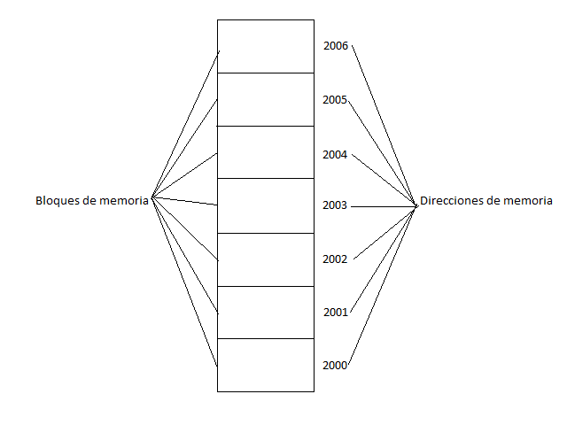
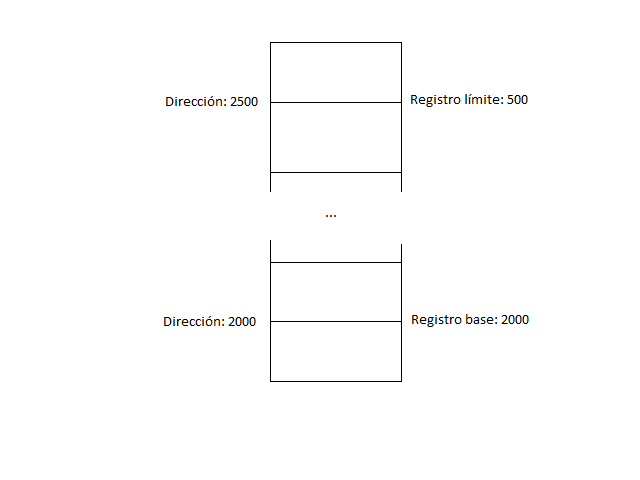
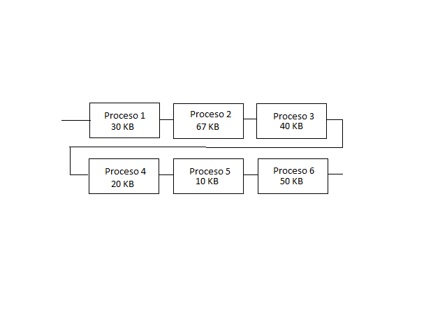
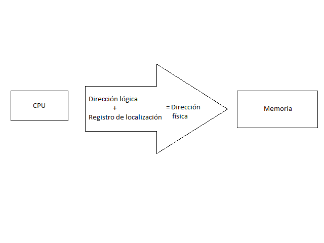
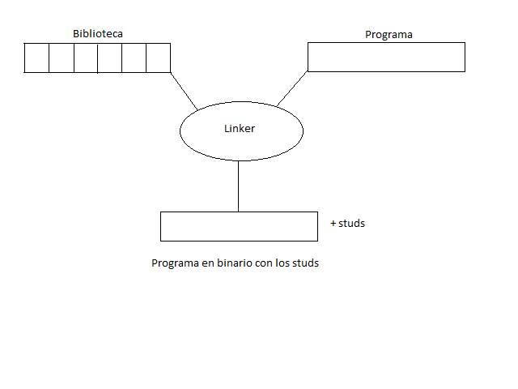
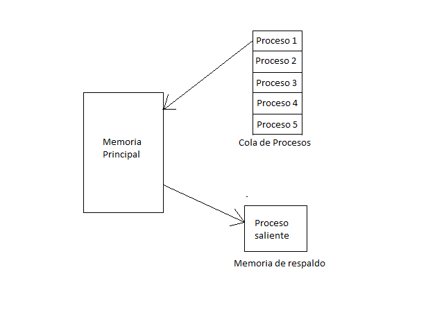
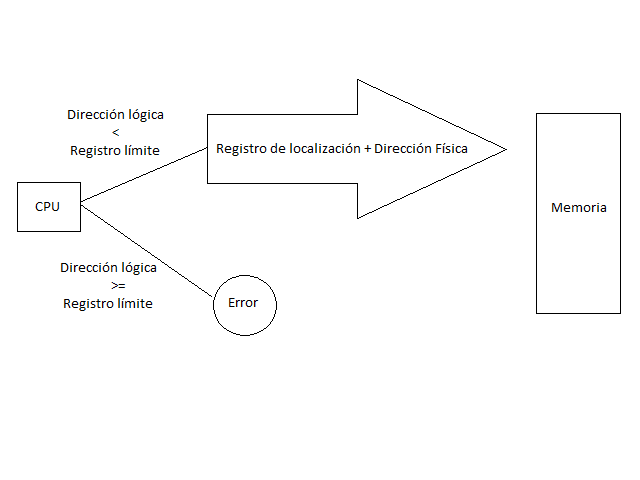
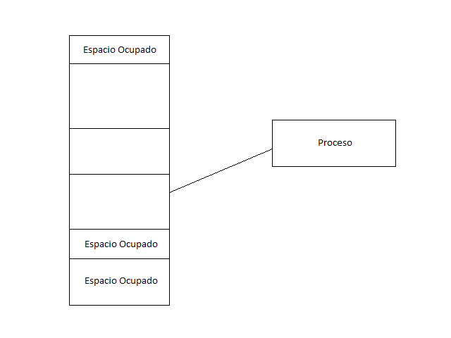
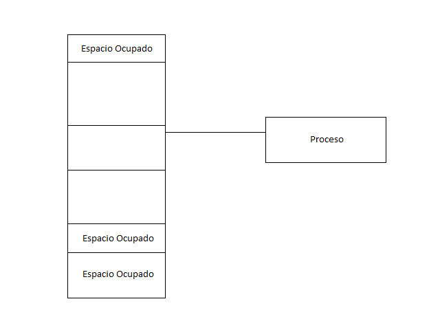
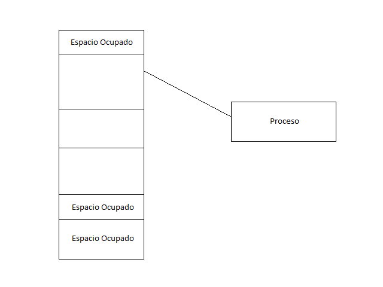

Administración de memoria
=========================

Recopilado por: Carolina Gonzalez Vargas, Rubén Mora Meneses y Esteban
Ramírez Quirós.

Fundamentos
-----------

La *memoria* o *memoria principal* puede ser considerada como una matriz
de bytes, cada uno con una dirección. El *administrador de memoria* es
parte del sistema operativo que regula el uso o liberación de la
memoria. Una *instrucción* es una orden que se le da a la computadora
para que ejecute una operación. Un *proceso* es una secuencia de
instrucciones que forman parte de un programa en ejecución.

La memoria es un recurso necesario en todo sistema informático y por eso
debe ser gestionado con cuidado, esta operación la ejecuta el
administrador de memoria o *Memory Manager*. El administrador de memoria
está encargado de asignar la memoria que necesita un proceso, así como
liberarla cuando el proceso la haya desocupado. También debe estar al
pendiente de qué secciones de la memoria se están utilizando y cuáles
no, así como debe tener control sobre cuáles procesos están utilizando
la memoria.

Para poder administrar la memoria es necesario poder acceder a ella ya
sea para leerla, guardar datos o simplemente reservarla, los bytes de la
memoria pueden accederse por medio de direcciones, las cuales pueden ser
representadas de diferentes maneras. En un programa fuente se utilizan
direcciones simbólicas, que más adelante representan direcciones
concretas en un programa ejecutable.

En una computadora la memoria principal es un recurso vital para su
funcionamiento ya que no solo los programas pueden modificarla, sino que
también los dispositivos de entrada y salida pueden tener acceso a ella
y modificarla. El procesador de la computadora es el que debe regular
los accesos a a memoria y la velocidad de este para accederla y
modificarla (ya sea para escribir o borrar datos) dependerá de la
eficiencia del computador.

Hardware básico
~~~~~~~~~~~~~~~

El *direccionamiento de memoria* se refiere a cualquier intento de
acceder a la memoria ya sea para leerla, escribir en ella o borrar su
contenido, por medio de una dirección.

Los *registros del procesador* son espacios pequeños de memoria en el
procesador que se utilizan, entre otras cosas, para que las
instrucciones del procesador tomen de ahí los datos que necesitan para
procesarlos.

Al desarrollar el hardware de una computadora, se debe definir la forma
en que se va a direccionar la memoria. El máximo direccionamiento que
puede tolerar una computadora se define según la cantidad de bits que
posean las direcciones a generar, si se toma ése número de bits como
exponente de 2 se puede obtener el máximo direccionamiento posible, lo
que quiere decir que aunque el computador disponga de más memoria, será
imposible accederla, por ejemplo, si se tienen direcciones de 8 bits,
solo se podrá acceder hasta 256 bits de memoria. Cuando se define el
hardware, también se especifica la menor unidad de memoria
direccionable, es decir se escoge una cantidad mínima de bits a
direccionar, lo que implica que las siguientes posiciones en memoria
tendrán ese tamaño.

Por otra parte, la memoria principal y los registros del procesador son
las únicas secciones que pueden ser accesadas directamente, e incluso
muchas de las instrucciones de la máquina toman como parámetro el
contenido de los registros ya mencionados, pero no hay instrucciones que
acepten direcciones de la memoria en disco, lo que implica que si se
necesitan datos de la memoria en disco, deben copiarse en los registros
o en memoria principal para poder ser utilizados. Es decir que, para
poder ejecutar un proceso, es necesario asegurarse de que este posea un
espacio en memoria exclusivo para su uso y el rango legal de direcciones
de memoria disponibles, esto se hace por medio del almacenamiento de un
registro base y un registro límite. El registro base guarda la primera
dirección en memoria que corresponde a ese proceso, mientras que el
registro límite muestra el rango máximo de memoria que necesita el
proceso, por ejemplo, si el registro base equivale a la posición 2000 en
memoria y el registro límite tiene un valor de 500, el proceso ocupa un
espacio en memoria desde la dirección 2000 hasta la 2500.

Es posible proteger el espacio en memoria para cada proceso, esto se
logra haciendo que el CPU compare las direcciones generadas en modo
usuario con el contenido de los registros a los que se desea acceder y
en cualquier intento de acceder a direcciones que no le correspondan,
generar un error fatal.

Reasignación de direcciones
~~~~~~~~~~~~~~~~~~~~~~~~~~~

La memoria usualmente aloja varios procesos al mismo tiempo y, de hecho,
se busca maximizar el uso del procesador teniendo una reserva de
procesos a ejecutar, esta lista se llama *cola de procesos*.

Como el programador no sabe cuáles otros procesos van a estar en memoria
al mismo tiempo que el proceso que desea ejecutar, es necesario mover el
programa a otra área de memoria en caso de ser necesario, es decir, si
se necesita el espacio de memoria que está utilizando ese proceso, el
sistema operativo debe ser capaz de mover el proceso, ejecutar otro y
volver a cargar el proceso anterior justo en la instrucción en que había
quedado antes de que fuera interrumpido.

Habitualmente se selecciona uno de los procesos de la cola de procesos,
este se carga en memoria y luego es ejecutado, cuando este termina, el
espacio de memoria en el que fue cargado, se declara libre para ser
utilizado por otro proceso. Para hacer esto, el editor de montaje o
cargador se encarga de asignar las nuevas direcciones del proceso que se
está cargando en memoria y una vez asignadas las nuevas direcciones,
poder ejecutar el proceso.

La reasignación de instrucciones y datos en memoria puede hacerse en
cualquiera de las siguientes etapas:

-  Tiempo de compilación: solamente si se sabe con certeza en dónde va a
   ser almacenado el programa cuando este sea compilado, se pueden
   generar direcciones absolutas ya que no va a haber ningún
   inconveniente con el acceso a la memoria.
-  Tiempo de carga: si no se sabe a dónde se alojará el proceso cuando
   este sea compilado, las direcciones deben ser reubicables, de modo
   que la asignación de direcciones se retrasa hasta cuando el proceso
   necesita ser cargado en memoria.
-  Tiempo de ejecución:Si no hubiese problema con retrasar la
   reasignación de direcciones hasta el tiempo de ejecución, es
   recomendable hacerlo, pero para esto se necesita de un hardware
   especial, sin embargo, la mayoría de sistemas operativos de propósito
   general utilizan este método.

Espacios de direcciones lógico y físico
~~~~~~~~~~~~~~~~~~~~~~~~~~~~~~~~~~~~~~~

Una *dirección lógica* o *dirección virtual* es una dirección generada
por el CPU, mientras que una *dirección física* es una dirección de la
unidad de memoria. Las direcciones lógicas que son generadas por un
programa son llamadas, como conjunto, *espacio de direcciones lógicas*,
estas generan también el *espacio de direcciones físicas*, el cual el
conjunto de las direcciones físicas homólogas a las direcciones lógicas.

Se tienen también la *unidad de gestión de memoria* (MMU o
*memory-management unit*)la cual es una parte del hardware que hace la
equivalencia entre las direcciones virtuales y físicas en tiempo de
ejecución.

También se cuenta con el *registro de ubicación*, el cual es un sinónimo
para el registro base, el cual suma todas las direcciones generadas por
un proceso de usuario cuando se está cargando el proceso en memoria.

La memoria de una computadora se organiza en por lo menos dos niveles:
principal y secundaria. La memoria principal proporciona un acceso
rápido a esta pero el costo es elevado, también es volátil, es decir, su
almacenamiento de información no es permanente. Por otra parte, la
memoria secundaria, se organiza de una manera similar a la memoria
principal sin embargo es lenta, barata y no volátil, lo que permite
almacenar información por mucho tiempo, ya sean programas, datos o
ambos.

Si el sistema operativo puede administrar de forma correcta y efectiva
las memorias disponibles, es capaz de proveer las siguientes ventajas:

-  Los módulos pueden compilarse y escribirse de forma independiente.
-  Se puede dar varios grados de protección de datos.
-  Los procesos podrían compartir módulos.

Carga dinámica
~~~~~~~~~~~~~~

La *carga dinámica* consiste en cargar las rutinas hasta que sean
invocadas, es decir, no se cargan hasta que se necesitan y todas las
rutinas se mantienen en un disco en un formato reubicable y también se
aplaza el cálculo de direcciones. Cuando una rutina en un proceso
necesita convocar a otra, primero revisa si ya está cargada, de lo
contrario la busca y la carga en memoria para su uso con el cargador de
memoria, esto implica la actualización de las tablas de direcciones del
programa para dar evidencia del cambio generado al cargar la rutina.

Esto proporciona como ventaja que si una rutina no se necesita en tiempo
de ejecución, nunca será cargada en memoria, por lo tanto ahorrará
memoria y resulta útil si se necesita disponer de mucho código para
administrar casos poco frecuentes.

Montaje dinámico y bibliotecas compartidas
~~~~~~~~~~~~~~~~~~~~~~~~~~~~~~~~~~~~~~~~~~

Para poder comprender el montaje dinámico es importante definir el
*montaje estático* y *montaje binario*.

El *montaje estático* se da cuando las bibliotecas del lenguaje
utilizado en el sistema son tomadas como un módulo y son integradas en
el programa. Por otra parte el *montaje binario* se da cuando se pospone
hasta el tiempo de ejecución el montaje del programa. Sin embargo el
*montaje dinámico* ocurre cuando en el fragmento de código se incluye un
*stud*, una pieza de código que indica cómo encontrar o agregar la
rutina deseada en la imagen binaria.

Es decir, el montaje dinámico retrasa el montaje de los módulos externos
hasta que el módulo de carga haya terminado de crearse.

Algunos sistemas operativos no permiten el montaje dinámico, sino que
solamente el estático.

Intercambio
-----------

Normalmente en los sistemas actuales, tener recursos ociosos o sin
utilizar, es considerado un desperdicio de ellos, esto incluye a la
memoria, los sistemas de la actualidad suele mantener ocupada un gran
porcentaje de ella, esto puede ocasionar situaciones donde no haya
suficiente memoria disponible para un proceso que requiere ser
ejecutado.

Una de las soluciones ante este problema es el intercambio de procesos,
esto consiste en intercambiar temporalmente un proceso que esta en
memoria con uno que se encuentre en la cola de procesos, guardando en un
almacén de respaldo el proceso que se encuentra en memoria, y
volviéndolo a llevar luego a memoria para continuar su ejecución.[1]

Para poder realizar esto, es necesario una cola de procesos, como se
mencionó anteriormente. Por ello, el sistema mantiene esta cola de
procesos donde se encuentran todos los procesos que estén listos para
ser ejecutados, tanto los que se encuentran en el almacén de respaldo
como los que se van a ejecutar por primera vez.[1]

Este proceso de intercambio tiene un costo de tiempo relativamente alto,
del cual la mayor parte del tiempo es tiempo de transferencia, el cual
es directamente proporcional a la cantidad de memoria intercambiada. Por
ello la duración de este proceso de intercambio es proporcional al
tamaño del proceso a intercambiar.

Para esta operación sea realmente útil, el tiempo de ejecución del
proceso que ingresa en memoria debe ser lo suficientemente grande en
relación con el costo del tiempo de intercambio, para que este pueda
realizar una cantidad de cálculos lo suficientemente grande entre una
operación de intercambio y la siguiente.

Normalmente cuando un proceso almacenado, vuelve a ser cargado, este se
volverá a cargar en el mismo espacio de memoria que ocupó anteriormente.
Esta restricción es impuesta por el método de reasignación de las
direcciones. [1]

Pero este proceso de intercambio, no se puede realizar con cualquier
proceso que se encuentre en memoria, para poder realizar esto, los
procesos deben estar completamente inactivos. por ejemplo si el proceso
no podrá ser intercambiado si se está accediendo a donde residen los
buffers de E/S en la memoria. ya que aunque el proceso parezca inactivo,
realmente no lo está.

Existen ciertas mejoras que se le pueden realizar a este mecanismo, como
la utilización de un doble buffer que permita cargar o descargar un
proceso mientras otro se encuentra en ejecución; o combinar la técnica
con el uso de registros base y límite, para mantener varios procesos
simultáneamente en memoria.

También este mecanismo se puede implementar en conjunto con algoritmos
de planificación con prioridad. Esto consiste es que si llega un proceso
de mayor prioridad y este necesita ser ejecutado, el administrador de
memoria puede intercambiarlo por un proceso inactivo de menor prioridad.
Cuando el proceso de mayor prioridad haya terminado, puede
intercambiarse de nuevo por el proceso de menor prioridad.[1]

En la actualidad, aunque en muchas versiones de UNIX se utiliza una
variante de este sistema, el intercambio está normalmente desactivado,
por ello en realidad estos mecanismos de intercambio se utilizan en
pocos sistemas, ya que en general requieren el costo en tiempo de este
mecanismo es muy alto y no logran proporcionar tiempos de ejecución
suficientemente largos como para realizar una compensación favorable y
que haga de esto una solución razonable de gestión de memoria.

Asignación de memoria contigua
------------------------------

Como todo proceso que necesite ser ejecutado estar albergado en memoria,
esta debe albergar tanto el sistema operativo como los diversos procesos
que ejecute el usuario.

Normalmente ambos, el sistema operativo como el espacio del usuario, no
comparten el mismo espacio por eso usualmente la memoria esta dividida
en 2 particiones, una para el sistema operativo y otra para los procesos
que desee ejecutar el usuario. [1]

Mapeo de memoria y protección
-----------------------------

Como los sistemas no utilizan direcciones predefinidas como puede ser
direcciones físicas de memoria, sino que utilizan las direcciones
absolutas de un programa, las cuales son imposibles de calcular en
tiempo de compilación porque no se conoce la ubicación del programa, por
lo que no se puede asegurar una protección a la memoria. [2]

El registro de ubicación, o bien el registro base ilustra la posición
inicial del programa, mientras que el registro límite guarda la cantidad
de memoria que necesita el programa, por lo que el registro límite no
corresponde a una dirección de memoria como tal, sino a un
desplazamiento desde el registro de reubicación. [1]

Una dirección lógica señala una posición en memoria que no depende de la
asignación de memoria que se le ha dado al proceso. Toda dirección
lógica tiene que ser menor que el valor que contiene el registro límite,
se convertirá la dirección lógica dinámicamente con la MMU, esto se
logra sumando el valor del registro base, esta nueva dirección es la que
se envía a memoria.

Una dirección relativa se representa como un desplazamiento desde una
posición en memoria conocida, usualmente es del inicio del programa,
pero bien podría ser una dirección posterior. Las direcciones relativas
necesitan pasar por dos etapas en las cuales el procesador las manipula.
La primera agrega el valor del registro base a la dirección relativa de
modo que se obtiene una dirección absoluta para el programa.
Seguidamente, la nueva dirección es comparada con el valor del registro
límite, si esta se encuentra dentro de los límites, se procesa
ejecutando la instrucción correspondiente, pero si no, se interrumpe el
sistema generando un error.[2]

Para asegurar la integridad, seguridad y protección del sistema las
referencias a memoria que son hechas con un proceso deben ser validadas
para estar seguros de que solamente referencian el espacio de memoria
que está reservado para el proceso.

Un proceso que es seleccionado por el planificador del CPU para ser
ejecutado, los valores correctos de los registros de límite y
reubicación son cargados por el despachador como parte de un cambio de
contexto. Este mecanismo protege el sistema ya que las direcciones
generadas por el CPU se comparan con los registros con ello se asegura
que no se accedan a regiones de memorias no correspondientes al
proceso.[1]

Asignación de memoria
---------------------

Las estructuras de datos son necesarias para que el sistema operativo
sea capaz de administrar apropiadamente las particiones en memoria, por
ejemplo, una tabla de descripción de particiones en la que se registre
cuáles procesos están alojados en cada partición, así como dónde
comienza y dónde termina. Los huecos en memoria que queden libres serán
usados para administrar el espacio disponible.[3]

Al dividir la memoria en particiones de tamaño fijo, se logra un método
simple para asignar la memoria. Cada sección solamente puede contener un
proceso porque la multiprogramación está limitada por la cantidad de
particiones que no alojan ningún proceso. Aparte de esto, las
particiones fijas también fuerzan al sistema a mantener una tabla que
indique qué partes de la memoria están libres para que otros procesos la
utilicen y cuáles están ocupadas.

Actualmente los sistemas operativos modernos no utilizan el esquema de
particiones fijas, sin embargo, los sistemas operativos de los grandes
computadores de IBM, el OS/MFT, o bien Multiprogramación con un número
fijo de tareas, es un buen ejemplo de un sistema operativo eficiente que
utiliza este esquema. [2]

Las particiones múltiples funcionan cuando una partición está libre,
seguidamente se escoge un proceso de la cola de entrada y es cargado en
esa partición. Al terminar el proceso, la sección queda disponible para
ser ocupada por otro proceso.

El hecho de distribuir la memoria disponible en particiones de tamaños
distintos de memoria, aumenta la flexibilidad de la repartición de
memoria. Además de esto, la partición dinámica provee un esquema por
medio del cual el número y longitud de las particiones son variables. Al
traer un proceso a la memoria principal, este esquema ayuda a que se le
asigne únicamente el espacio en memoria que necesita, ni más, ni menos.
[2]

La fragmentación externa se da cuando la memoria externa se fragmenta
cada vez más. Cuando un proceso necesita memoria, se busca un espacio
tan grande como para poder alojarlo y si se encuentra, se le asigna y se
mantiene la demás memoria libre para las solicitudes de los procesos que
entrarán en el futuro. [1]

Con forme los procesos entran al sistema, también se ingresan a una
cola. Esta cola de entrada se ordena por el sistema operativo según el
algoritmo de planificación que este posea. Se le asigna memoria a los
procesos hasta que los requisitos del siguiente proceso ya no puedan
satisfacerse. El sistema operativo considera la memoria necesaria para
cada proceso y lo compara con la cantidad de memoria libre para ser
utilizada, de este modo se puede determinar a cuáles procesos se les va
a asignar memoria.

El agujero es un modo de llamar a toda la memoria disponible para los
procesos de usuario cuando esta se considera como un bloque único que
contiene toda la memoria libre para ser utilizada por los procesos
entrantes. En algún momento durante la ejecución de los procesos se va a
tener un conjunto de huecos de memoria de muchos tamaños distribuidos
por toda la memoria y cuando llega un proceso nuevo para ser ejecutado y
este solicita memoria, el sistema operativo busca entre todos esos
espacios libres alguno que sea lo suficientemente grande como para poder
alojarlo. [1]

Si el agujero es muy grande, se divide en dos partes, una para el
proceso y la otra se agrega al conjunto de espacios de memoria
disponibles. Caso contrario ocurre si hay agujeros de memoria
adyacentes, estos se fusionan para obtener un espacio en memoria más
grande en lugar de dos pequeños.

El proceso, al terminar, libera la memoria que había utilizado para
poder ejecutarse y esta memoria se volverá a considerar como libre y se
agrega al conjunto de agujeros de memoria.[1]

La asignación dinámica de espacio busca satisfacer las solicitudes de
memoria según la lista de espacios disponibles.

El primer ajuste, se conoce como el método de asignar el primer agujero
en memoria que se encuentre que sea lo suficientemente grande como para
alojar el proceso entrante, la exploración de memoria puede hacerse
desde el inicio de la memoria o bien donde terminó la exploración
anterior y la exploración se detiene en cuanto se encuentre un hueco de
memoria con la cantidad de memoria igual o superior al espacio requerido
por el proceso. [1]

Como se puede observar en la imagen, el mejor ajuste es un método de
asignación de memoria en que se busca el bloque de memoria disponible
más pequeño pero que tenga espacio suficiente para el proceso, pero este
método puede generar un agujero de memoria más pequeño que en los demás
métodos. [1]

El peor ajuste asigna el agujero de memoria de mayor tamaño que
encuentre durante la exploración, esto genera un agujero de mayor tamaño
luego de haber asignado el proceso, lo que puede generar un agujero muy
útil. [1]

Los métodos del primer ajuste y mejor ajuste son mejores que el del peor
ajuste en matices como el tiempo necesario y utilización eficiente del
espacio. Aunque es indefinido si la estrategia del primer ajuste o mejor
ajuste es mejor en cuestión de utilización del espacio de
almacenamiento, pero la del primer ajuste es más rápida. [1]

Existen otras políticas que generan menos fragmentación de memoria y de
hecho son muy utilizados en los sistemas operativos, por ejemplo la
política de los gemelos (buddies). [3]

En este sistema, el asignador nada más provee de bloques de memoria de
tamaños determinados y tiene muchas listas libres, una para cada tamaño
que sea capaz de asignar. Los espacios habitualmente se calculan como
potencias de dos o según la secuencia de Fibonacci. Si el repartidor
recibe una solicitud de memoria, el tamaño es redondeado hasta que el
tamaño solicitado lo permita y se le asigna el primer bloque libre con
este tamaño. [4]

El reciclaje de bloques implica hacer un intento por mezclar los bloques
de memoria adyacentes en un bloque más grande, para simplificar el
trabajo, las listas pueden almacenarse en orden de dirección. Este
enfoque provee una ventaja: la coalición es barata porque todo bloque
libre se calcula desde su dirección. [4]

El sistema buddy puede trabajar muy bien, pero también puede trabajar
muy mal según sean los tamaños seleccionados para interactuar con las
solicitudes de memoria y según sea el patrón de los bloques. Redondear
implica una cantidad de memoria significativa que se desperdicia, a lo
que se le llama fragmentación interna, la cual se puede reducir haciendo
que el tamaño de los bloques sea similar. [4]

Segmentación
------------

La segmentación se puede definir como una técnica en la cual las tareas
y procesos pueden acceder a ellas unitariamente para poder administrar
mejor la memoria contigua, facilita la comprensión visual del
programador, es la estructura clave para las pilas, datos y código para
un programa.

Están conformados por un tamaño predefinido, un identificador y un
desplazamiento para acceder a los datos dentro de él, cada dirección
lógica se expresará mediante dos valores, el número de segmento (s) y
desplazamiento dentro del segmento (d), estas características se les
asigna en el proceso de compilación y para accederlos se debe tener en
cuenta que la memoria física se accede literalmente, cada dirección
lógica (que proviene del procesador) habrá que convertirla en una
dirección real, que la memoria RAM podrá leer, este cambio lo realiza un
aparato de hardware alojado generalmente en las tarjetas de memoria
principal llamado unidad de gestión de memoria, ya que posee algunos
implementos como la tabla donde vienen numeradas cada segmento. Además
el procesador cuenta con otra tabla que describe:

-  Base: Dirección en donde comienza el segmento (contando la dirección)
-  Límite: Dirección en donde finaliza (sin contar la dirección)
-  Desplazamiento: Lo que hay que sumar a una dirección para obtener su
   dirección real, se calcula como la dirección de comienzo del segmento
   en la memoria real menos la dirección virtual de inicio del segmento
-  Atributos del segmento: como lectura/escritura para la seguridad de
   que otros procesos interfieran en “segmentos ajenos”.

Para seguridad del manejo de segmentos hay 2 “heaps”, uno para los
segmentos en sí y otro para administración de estructuras de datos, como
colas y pilas, en el primero como hay muchos segmentos a través de la
línea del tiempo de los procesos, segmentos son asignados a una parte de
la memoria y otros liberados, y esto fragmenta mucho la memoria
produciendo desperdicio y múltiples pedazos de memoria tan pequeños que
no se pueden utilizar, afortunadamente hay métodos y algoritmos para
reducir el impacto de desperdicio que producen la fragmentación:

-  First-fit: consiste en recorrer la lista secuencialmente hasta hallar
   el primer fragmento donde quepa la memoria solicitada, el trozo
   encontrado se parte en dos para entregar sólo lo que se necesita
-  Best-fit: Consiste en recorrer la lista secuencial y completamente
   hasta hallar el fragmento donde quepa la memoria solicitada y se
   desperdicie el menor espacio posible, el trozo encontrado se parte en
   dos para entregar sólo lo que se necesita
-  Worst-fit: consiste en recorrer la lista secuencialmente hasta hallar
   el primer fragmento donde quepa la memoria solicitada y sobre la
   mayor cantidad de memoria posible, el trozo encontrado se parte en
   dos para entregar sólo lo que se necesita

De las anteriores la segunda es la menos efectiva ya que llena la
memoria de pequeños trozos de memoria inútiles y el proceso para
reunificarlos y reciclarlos es sumamente caro en procesamiento en
función a la cantidad, mientras que la mejor solución es la de
first-fit, debido que estadísticamente desperdicia menos, lo ideal es
implementar siempre este método aunque resulta ineficiente en parte, ya
que siempre comienza desde el inicio aun cuando no se le ha notificado
que se ha liberado un espacio para que se devuelva y verifique si cabe
el proceso, en lugar de dejar un puntero donde quedo para que a partir
de ahí siga buscando sin necesidad de que se devuelva a buscar espacios
que por redundancia se sabe que no son suficientemente grandes.

Algunas características positivas que aporta la segmentación son la
modularidad, cada segmento es independiente uno del otro, se puede
afectar uno sin que el otro tenga represalias, entre otras como
protección, compartición, estructuras de datos largas, enlace dinámico
entre segmentos.

En conclusión el esquema de la segmentación presenta algunas ventajas
como las siguientes: conocimiento de las partes lógicas del programa de
parte del programador, los segmentos se pueden tratar como módulos
separados y cada uno se puede compilar por aparte (en la compilación es
donde se crean las uniones entre segmentos), como son separados unos de
otros son fáciles de modificar uno por uno sin afectar a los otros, la
manera de compartir los módulos es sencillo, pueden crecer en caliente o
en tiempo de ejecución según las necesidades del programa, es posible
crear segmentos aun cuando no existan o cuando ni siquiera se le han
asignado espacio (por ejemplo cuando no se sabe el tamaño de un vector
hasta que sea tiempo de ejecución para asignarle el que necesita).

Algunas desventajas de la segmentación: incremento en los costos de
hardware y de software para llevar a cabo la implantación y su consumo
en recursos, producen mucha fragmentación externa, en la memoria virtual
podría representar un problema ya que estos funcionan con bloques fijos
y los segmentos varían su tamaño y a su vez está requiere una
reubicación, o sea, más procesamiento consumido, la compartición entre
segmentos es útil pero se necesita mecanismos de hardware y software
adicionales para llevarlo a cabo, la implementación de la instrucción
fork() es ineficiente, todas estas desventajas tratan de ser minimizadas
por la siguiente técnica, la segmentación paginada.

Segmentación paginada
~~~~~~~~~~~~~~~~~~~~~

La segmentación no suple al 100% con la necesidad de aprovechamiento de
la memoria, la paginación es otra técnica que compite con ésta para el
mejor rendimiento, aunque tampoco lo logra, se ha creado un método más
efectivo que aprovecha las ventajas de ambas llamado Segmentación
paginada, lo que sucede es que hay una administración segmentada pero el
contenido usado para memoria contigua de cada segmento de página, el
segmento tendría que tener su propia tabla de páginas con 3 variables de
dirección como lo son S, P, D; la S es por el número de segmento, la P
para el número de página, y el D para el desplazamiento a partir de ahí,
además de SMT que es la tabla de mapas de segmentos que a su vez tiene
en cada entrada un PMT que es la tabla de mapas de página por cada
segmento.

Ventajas de la segmentación paginada: junta las ventajas de la
paginación y la segmentación, se simplifican mucho las formas de
almacenamiento, se elimina casi por completo la fragmentación externa y
la necesidad de usar ese costoso algoritmo de compactación.

Desventajas de la segmentación paginada: la incorporación de los
controles necesarios para el sistema incrementa en cuanto a
procesamiento y uso de memoria, no logra eliminar la fragmentación
interna, la paginación pura siempre se desperdicia la última página,
pero en este método se desperdiciaran en función a los segmentos
seleccionados

Fragmentación
~~~~~~~~~~~~~

Todos estos métodos intentan eliminar a un enemigo en común llamado
“Fragmentación”, pero ¿Qué es la fragmentación?, es la incapacidad de
poder tratar la memoria como asignamiento secuencial para abastecer los
procesos sin dejar desperdicios, la manera de eliminarla sería hacer que
los procesos caigan en gravedad para dejar todos los trozos libres en la
parte superior y poder fusionarlos pero eso sería demasiado ineficiente.
Hay dos tipos de fragmentación, la interna y la externa, la interna es
cuando la memoria contigua se fragmenta y la externa también pero cuando
la memoria que se fragmenta no es contigua, cuando una memoria no es
contigua o parte de ella no lo es, significa que no está destinada a
asignación de procesos aunque sí para satisfacer requerimientos.

Glosario
--------

-  **Cola de procesos**: Son los procesos que estén esperando a ser
   cargados en memoria para su ejecución por parte del sistema.
-  **Dirección base**: Es la dirección física inicial del lugar donde el
   segmento reside dentro de la memoria.
-  **Dirección límite**: Es la dirección que especifica la longitud de
   un segmento específico.
-  **Espacio de direcciones lógicas**: Es el conjunto de todas las
   direcciones lógicas.
-  **Mejor ajuste**: Asigna el espacio más pequeño que tenga el tamaño
   suficiente. Tiene como ventaja que genera el espacio más pequeño
   posible restante.
-  **Memoria**: Es dispositivo basado en circuitos que posibilitan el
   almacenamiento limitado de información y su posterior recuperación.
-  **Peor ajuste**: Es una posible solución para el problema de
   asignación dinámica de espacios de almacenamiento, el cual asigna el
   mayor espacio de tamaño disponible.
-  **Primer ajuste**: Es una posible solución para el problema de
   asignación dinámica de espacios de almacenamiento, el cual asigna el
   primer espacio de memoria que sea lo suficientemente grande.
-  **Registro de reubicación**: Es el registro base, el valor contenido
   en este registro suma todas las direcciones generadas por un proceso
   de usuario en el momento de enviarlas en memoria.
-  **Tabla de segmentos**: Es una implementación para manejar las
   direcciones bidimensionales definidas por el programa sobre las
   direcciones físicas unidimensionales.
-  **Unidad de gestión de memoria (MMU, memory-management unit)**: Es un
   dispositivo de hardware que establece la correspondencia entre
   direcciones virtuales y físicas en tiempo de ejecución.
-  Crecer en caliente: por lo general la expresión que acompaña a "en
   caliente" se refiere a que no se necesita reiniciar el proceso o
   apagar el proceso realizar el cambio y volverlo a ejecutar, si no que
   se puedan hacer cambios durante su ejecución.
-  Instrucción fork(): función del lenguaje C/C++ exclusivo en Unix el
   cual permite formar nuevos procesos en paralelo.
-  STM: mapa que usa la segmentación paginada para controlar los
   segmentos (Segment table map)
-  PMT: mapa que usa la segmentación paginada para controlar las páginas
   (Page Map Table)
-  Carga dinámica: consiste en cargar rutinas en memoria cuando es
   convocada por el programa, no antes.
-  Dirección física: dirección generada por un programa.
-  Dirección lógica o virtual: dirección generada por el CPU.
-  Montaje binario: se pospone hasta el tiempo de ejecución la carga del
   programa.
-  Montaje dinámico: incluir un stud en la imagen binaria para encontrar
   y cargar una rutina cuando esta sea convocada.
-  Montaje estático: incluir el código de las bibliotecas en la imagen
   binaria del programa.

Referencias
-----------

Martínez y Díaz, en su libro *Sistemas Operativos: Teoría y práctica*
(Consultar fuente [1]) plantean una introducción a los conceptos de
memoria y el administrador o gestor de memoria involucrados en el
desarrollo de un sistema operativo y explica con detalle la forma en que
se maneja la memoria disponible entre los procesos que están siendo
ejecutados.

Tanenbaum, en su libro *Sistemas Operativos Modernos* (Consultar fuente
[2]) detalla el concepto de memoria, su jerarquía y administración,
también explica los conceptos de carga dinámica y de montaje dinámico
así como sus bibliotecas compartidas. Este libro también hace referencia
a la asignación de direcciones.

Morera y Pérez-Campanero, en su libro *Conceptos de sistemas operativos*
(Consultar fuente [3]) ofrecen no solamente una definición de memoria
sino que le dan una dimensión de recurso central, lo que los lleva a
explicar las formas de accesar las jerarquías de memoria y por lo tanto,
también explica cómo se integra la memoria al hardware de la computadora
y la asignación de direcciones.

Stallings, en su libro *Sistemas Operativos* (Consultar fuente [4]) da
una definición de memoria y su administrador, pero también explica el
comportamiento de la memoria en sistemas monoprogramados y
multiprogramados. Este libro es más detallado con respecto a la
reasignación de direcciones ya que explica qué sucede cuando la memoria
es compartida por varios procesos, así como la carga y descarga de
procesos. También de detalla la diferencia entre la memoria principal y
la memoria secundaria, sus características y las ventajas de un buen
sistema de gestión y acceso de memoria. Además explica con detalle la
definición de carga dinámica y los diferentes tipos de montajes.

Silberschatz, Baer y Gagne, en su libro *Fundamentos de Sistemas
Operativos* (Consultar fuente [5]) explican los términos de registro
base y límite, así como los detalles del hardware necesario para que un
sistema operativo pueda manejar apropiadamente la memoria, también
explica la forma en que se puede asegurar el espacio de un programa en
memoria. También detalla la reasignación de direcciones y las
condiciones que deben cumplirse para poder realizar una reasignación en
las diferentes etapas de creación del software. Provee, además
definiciones claras para las direcciones lógicas y físicas y de la
utilización apropiada de la memoria en un sistema con carga dinámica,
así como el montaje dinámico.

Bibliografía
------------

[1] Martínez, P., Díaz, J. (1996). Sistemas Operativos: Teoría y
práctica. NS: Ediciones Díaz de Santos.

[2] Tanenbaum, A. (2003). Sistemas operativos modernos. NS: Pearson
Educación.

[3] Morera, J., Pérez-Campanero, P. (2002). Conceptos de sistemas
operativos. NS: Universidad Pontifica Comillas.

[4] Stallings, W. (1997). Sistemas Operativos. Madrid: Prentice Hall.

[5] Silberschatz, A., Baer P., Gagne, G. (2005). Fundamentos de Sistemas
Operativos. España: Cofás S.A.
