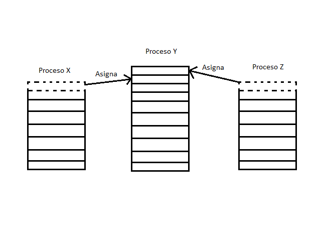

Memoria virtual
===============

*Recopilado por*: Julio Castro Bonilla, Carlos Fallas Victor y Walter
Román Quirós.

El término memoria virtual suele asociarse, con la capacidad que tienen
algunos sistemas, para acceder a direcciones, situadas en un espacio de
almacenamiento virtual, mucho mayor, que el disponible en el
almacenamiento real de un sistema informático determinado.

La memoria virtual es una técnica de gestión que, realizando una
combinación entre componentes de hardware y de software, en este caso el
sistema operativo, permite cargar programas parcialmente en la memoria
real. Esto hace parecer que la máquina tiene más memoria que la memoria
física que posee y de la que se sabe con anticipación.

Fundamentos
-----------

Los métodos más comunes para gestionar la memoria de los sistemas, que
permiten la existencia de un almacenamiento virtual, son la paginación y
la segmentación y en algunos sistemas, se puede utilizar una combinación
de los dos métodos. En los sistemas de almacenamiento real, para que un
proceso se pudiera ejecutar, era necesario que el proceso completo,
estuviese cargado en el almacenamiento real, sin embargo, los sistemas
de memoria virtual se caracterizan, muy especialmente, porque las
direcciones utilizadas por los programas en ejecución, no necesitan
estar todas ellas en el almacenamiento real.

Espacio de direcciones virtual
~~~~~~~~~~~~~~~~~~~~~~~~~~~~~~

El espacio de direcciones virtual de un proceso, se refiere a la vista
lógica (o virtual) de cómo un proceso se almacena en la memoria. Por lo
general, este punto de vista es que un proceso comienza en una dirección
determinada y a su vez existe en la memoria contigua.

Independencia física
~~~~~~~~~~~~~~~~~~~~

Este concepto se refiere a que al poseer la memoria virtual, ésta será
independiente de la memoria física, por lo cual, el sistema no estará
restringido solamente al espacio de la memoria física, si no que la
memoria virtual le dará un espacio adicional utilizable con las mismas
funciones que la memoria física. Esto da una ventaja adicional, y es que
se pueden ejecutar más programas al mismo tiempo, sin reducir el tiempo
de respuesta ni el de ejecución.

Biblioteca compartida
~~~~~~~~~~~~~~~~~~~~~

Los procesos que se encuentran alojados en la memoria virtual, tienen la
propiedad de compartir las bibliotecas del sistema, utilizando un
espacio de direcciones, el cual, como se menciona anteriormente es
compartido.

Compartimiento de memoria
~~~~~~~~~~~~~~~~~~~~~~~~~

La memoria virtual permite que los procesos puedan compartir el espacio
de memoria, se crea una región destinada para este fin, que será el
espacio de direcciones virtual de cada proceso que la comparte.

Carga simplificada del programa
~~~~~~~~~~~~~~~~~~~~~~~~~~~~~~~

Una función importante de la memoria virtual es la "reubicación" que
permite que el programa también se ejecute en cualquier lugar de la
memoria física.

Cantidad máxima de memoria
~~~~~~~~~~~~~~~~~~~~~~~~~~

Se puede aparentar más memoria de la que se tiene físicamente, pero,
dependiendo de las características del procesador, facilitándole al
programador el tener que preocuparse por mover los datos en memoria.

Paginación bajo demanda
-----------------------

Cuando se carga la memoria, todo el código ejecutable es cargado aunque
éste no vaya a ser utilizado por completo. La memoria virtual ofrece una
característica muy importante, que es la de administrar solamente el
código ejecutable con el que se trabajará, esto quiere decir, que
durante la ejecución del programa, sólo se cargarán las páginas en
memoria que el programa necesite y sean necesarias para que la ejecución
ocurra correctamente, las páginas que no sean utilizadas durante la
ejecución del programa no llegarán a cargarse en la memoria física.
Cuando se va a cargar un proceso, se realiza una estimación del espacio
que se utilizará en el proceso, entonces, no se cargan la totalidad de
las páginas, sino, solamente las necesarias; lo que reduce el tiempo de
carga y la cantidad de memoria física utilizada.

Intercambiador perezoso
~~~~~~~~~~~~~~~~~~~~~~~

El intercambiador perezoso es el componente que solamente realiza un
cambio de página cuando es estrictamente necesario. Para este caso en
específico de memoria virtual, se le llamará localizador, puesto que,
solamente carga las páginas necesarias y no todo el proceso, que
provocaría un gasto de memoria. Un intercambiador perezoso nunca
reincorpora una página a memoria a menos que se necesite. Como, desde
este punto de vista, un proceso se considera una secuencia de páginas en
vez de un gran espacio contiguo de direcciones, el término intercambio
es técnicamente incorrecto. Un intercambiador manipula procesos enteros,
mientras que un paginador trata con las páginas individualmente de un
proceso.

Paginación bajo demanda pura
~~~~~~~~~~~~~~~~~~~~~~~~~~~~

Bajo un esquema de paginación bajo demanda pura, el sistema nunca traerá
una página a la memoria hasta que se dé la petición de ésta. Se trata de
realizar paginación con intercambio, el bit de valídez de la tabla de
páginas indica si la página está o no en memoria.

Localidad de referencia
~~~~~~~~~~~~~~~~~~~~~~~

Cuando el procesador solicita al hardware cierta dirección de memoria,
el hardware transfiere a la memoria caché el byte o palabra solicitada y
además transferirá un bloque o página completa.

La localidad de referencia involucra varios conceptos, entre ellos:

-  Localidad temporal: Cuando un recurso es empleado, es muy probable
   que vuelva a ser utilizado en poco tiempo.
-  Localidad espacial: Es mas probable que un recurso que no sea
   requerido sea accesado que un recurso cercano.
-  Localidad secuencial: Un recurso, y muy particularmente la memoria,
   tiende a ser requerido de forma secuencial.

Tabla de páginas
~~~~~~~~~~~~~~~~

La tabla de página permite traducir direcciones virtuales a direcciones
físicas. Se encuentra indexada por el número de página virtual y
contiene la dirección física de la página. Se requiere un bit de válido
para indicar que la entrada contiene un página física válida, es decir
que esta se encuentra en memoria principal y no producirá fallo de
página.

El tamaño de la tabla de páginas es inversamente proporcional al tamaño
de página. Las tablas de páginas son habitualmente tan grandes que se
almacenan en memoria principal y, con frecuencia, paginadas ellas
mismas: se requiere un acceso a memoria para obtener la dirección física
y otro para obtener el dato.

Posee bits de control: válido, uso, sucio, permiso lectura y permiso
escritura además de una optimización en: jerarquía de tablas de página,
técnicas hashing (tablas de páginas invertidas) y buffer de traducción
anticipada (TLB).

.. figure:: _figures/memoriavirtual5.png
   :alt: 

Memoria Secundaria
~~~~~~~~~~~~~~~~~~

Esta memoria contiene las páginas que no se conservan en la memoria
principal. La memoria secundaria casi siempre es un disco de alta
velocidad.

Espacio de intercambio
~~~~~~~~~~~~~~~~~~~~~~

El espacio de intercambio es utilizado como áreas de almacenamiento de
memoria virtual cuando el sistema no tiene suficiente memoria física
para manejar los procesos actuales.

El sistema de memoria virtual asigna copias físicas de archivos en disco
a el sistema operativo puede buscar un proceso poco activo, y moverlo al
área de intercambio (el disco duro) y de esa forma liberar la memoria
principal para cargar otros procesos. Mientras no haga falta, el proceso
extraído de memoria puede quedarse en el disco, ya que ahí no utiliza
memoria física. Cuando sea necesario, el sistema vuelve a hacer un
intercambio, pasándolo del disco a memoria RAM.

Fallos de página
----------------

Un fallo de página es cuando un programa intenta acceder a un espacio de
sus direcciones, pero éste espacio no se encuentra cargado en la memoria
física del sistema. Cuando se da un fallo de página, el sistema
operativo debe responder cargando en memoria los datos que se quieren
acceder, permitiendo que el programa continúe con su ejecución normal.

El manejador de fallos de página determina cómo debe reaccionar el
sistema operativo ante un fallo de página. Puede determinar las
siguientes acciones:

-  Encontrar donde se encuentra la página en disco y leerla.
-  Cuando la página ya está en la RAM, reconfigura la Unidad de Manejo
   de Memoria (MMU) para que apunte a dicha página.
-  Apunta a una página que sólo ceros y si el proceso va a realizar una
   escritura, se le asigna una nueva página.
-  Obtener la página deseada desde otro lugar.

Ventajas
~~~~~~~~

Ejecutar un programa en la memoria virtual, permite una serie de
características positivas que se mencionan a continuación:

-  Permite que los programas que se ejecutarán en el sistema sean más
   grandes que la memoria física instalada.
-  Permite aumentar el grado de multiprogramación.
-  Sea necesaria menos e/s para intercambiar programas. -\* Se
   implementa generalmente mediante la paginación bajo demanda.

Desventajas
~~~~~~~~~~~

Así como las características positivas, se encuentran también varios
aspectos negativos que hay que considerar cuando se trabaja con memoria
virtual, los cuales son:

-  La paginación bajo demanda puede afectar significativamente al
   rendimiento de un sistema informático. Ya que ralentiza el proceso.
-  Carece de una zona de almacenamiento secundario donde almacenar las
   páginas.
-  Hacerlo en un archivo es más flexible, pero hay que sufrir las
   indirecciones del sistema de archivos.
-  Hacerlo en una partición o en un disco dedicado es más rápido, pero
   se pierde flexibilidad.
-  Se pueden ejecutar programas más grandes que la memoria física pero
   afectando negativamente la velocidad de ejecución del programa.
-  Dado que a menudo hay que traer páginas a memoria, surge el problema
   de cuáles reemplazar.

Copia durante escritura
-----------------------

Esta función es muy importante durante la ejecución de los procesos en
memoria virtual, porque permite que los procesos padre e hijo puedan
compartir las mismas páginas, éstas páginas son marcadas como "copia
durante escritura", esto permite que cualquiera de los dos procesos que
se encuentran compartiendo las páginas escriba en alguna de ellas,
inmediatamente se realiza una copia de la misma, para que la información
escrita pueda estar disponible solamente para el proceso que la escribió
en ese momento. Las páginas no modificadas por los procesos seguirán
siendo compartidas; además solamente podrán ser marcadas las páginas que
puedan ser modificas, por ejemplo, las que no sean las que contienen el
código ejecutable.

Esta característica ofrecida por la memoria virtual, mejora la
eficiencia de la memoria física, ya que es manejada de igual forma por
la misma memoria virtual. Así, cuando dos procesos necesiten tener
copias diferentes del mismo objeto, entonces la Unidad de Manejo de
Memoria (MMU) se encarga de realizar una copia compartida en la memoria
virtual y además de marcar ésta como página de "copia durante escritura"
en esa región de memoria.

Ventajas y desventajas de la utilización de la memoria virtual
~~~~~~~~~~~~~~~~~~~~~~~~~~~~~~~~~~~~~~~~~~~~~~~~~~~~~~~~~~~~~~

Ejecutar un programa en la memoria virtual, permite una serie de
características positivas que se mencionan a continuación: Permite que
los programas que se ejecutarán en el sistema sean más grandes que la
memoria física instalada. Permite aumentar el grado de
multiprogramación. Sea necesaria menos e/s para intercambiar programas.
Se implementa generalmente mediante la paginación bajo demanda.

Así como las características positivas, se encuentran también varios
aspectos negativos que hay que considerar cuando se trabaja con memoria
virtual, los cuales son: La paginación bajo demanda puede afectar
significativamente al rendimiento de un sistema informático. Ya que
ralentiza el proceso. Carece de una zona de almacenamiento secundario
donde almacenar las páginas. Hacerlo en un archivo es más flexible, pero
hay que sufrir las indirecciones del sistema de archivos. Hacerlo en una
partición o en un disco dedicado es más rápido, pero se pierde
flexibilidad. Se pueden ejecutar programas más grandes que la memoria
física pero afectando negativamente la velocidad de ejecución del
programa. Dado que a menudo hay que traer páginas a memoria, surge el
problema de cuáles reemplazar.

Sustitución de páginas
----------------------

La memoria de una máquina debe compartirse entre los muchos procesos que
están siendo ejecutados en la máquina y que solicitan espacios para
realizar tareas en memoria, y además entre las demandas de los
dispositivos de entrada y salida, como resultado tenemos muchos
mecanismos que pretenden hacer una asignación válida y funcional de la
memoria con la que cuenta el sistema.

Cuando un proceso intenta acceder a una página de memoria que se
encuentra ocupada o cuando un proceso solicita memoria y no se encuentra
ninguna página disponible se produce lo que conocemos como un fallo de
página; si un proceso provoca un fallo de página el sistema lo intentara
solucionar haciendo *sobreasignación de memoria*, el cual es un término
para describir los métodos que utiliza el sistema operativo para liberar
memoria poder asignar al proceso que provoque un fallo de página.

Entre los distintos mecanismos que utilizan los sistemas operativos
están: terminar un proceso, o descargarlo de memoria para poder
asignarla a nuevos procesos pero el método mas común, y con mejores
resultados es la *sustitución de páginas*, la cual cuenta con varios
mecanismos que serán explicados a continuación.

Mecanismos de sustitución de páginas:
-------------------------------------

Sustitución Básica
~~~~~~~~~~~~~~~~~~

La sustitución clásica o básica consiste en un mecanismo muy sencillo,
en el cual al producirse un fallo de página al no haber marcos
disponibles para un proceso el sistema operativo toma un marco sin
ningún criterio para escogerlo, y transcribe su información al espacio
de intercambio de la memoria para luego liberar el marco en el que se
encontraba dicha información, luego indica el cambio en la tabla de
páginas de la memoria.

Estos cambios pueden resultar muy costosos en tiempo y rendimiento de la
ejecución, debido a que es probable que para poder asignar la memoria
correctamente se deba repetir el proceso al menos dos veces, esto debido
a la mecánica del procedimiento que podría dejar sin espacio a un
proceso que ya se estaba ejecutando y éste volvería a solicitar memoria
al sistema operativo, para solucionar este problema se utiliza un
mecanismo conocido como *Bit Sucio* o *Bit de Modificación*, el cual
consiste en asociar a cada marco de memoria un bit específico en la
memoria, el cual se enciende si el marco es accedido por algún proceso
durante el último ciclo de reloj de la máquina, esto facilita escoger si
el marco se utiliza o no para sustitución, si fue accedido no se
sustituirá ya que es probable que vuelva a ser utilizado en el siguiente
ciclo de reloj.

Sustitución de Páginas FIFO
~~~~~~~~~~~~~~~~~~~~~~~~~~~

El término *FIFO* es la abreviatura de *first in first out* qué quiere
decir *primero en entrar primero en salir* y es así precisamente como
funciona este algoritmo de sustitución de páginas.

El mecanismo funciona de una manera muy sencilla, el administrador de
memoria marca o identifica cada página en el orden en que estas fueron
cagadas a la memoria, la primera en ser cargada, la segunda en ser
cargada y así sucesivamente, dichas marcas sirven para identificar cual
pagina sera sustituida, al ocurrir un fallo de pagina la primera de
estas que fue cargada a la memoria será la escogida para ser sustituida,
luego se cambian las marcas de las demás páginas haciéndolas avanzar un
lugar en el orden de entrada y marcando la pagina que recién fue
liberada como la última en cargarse.

El sistema *FIFO* es muy sencillo de implementar pero tiene una gran
desventaja, una falla en su funcionamiento conocida como la *Anomalía de
Belady*.

Anomalía de Belady
~~~~~~~~~~~~~~~~~~

La anomalía de Belady, descubierta en 1969 por el científico y
computólogo húngaro Laszlo Belady, consiste en un error en el
funcionamiento de los algoritmos de sustitución y que, particularmente,
es mucho más común cuando se utiliza el método *FIFO*, consiste en un
incremento de los fallos de página según se incrementa el tamaño de la
memoria, es decir, cuantos más marcos de memoria tenga el sistema mayor
incidencia de fallos de página ocurrirá, esto debido a el funcionamiento
del algoritmo.

Debido a esta característica el mecanismo de sustitución *FIFO* es
inadmisible para su uso en la administración de memoria actualmente.

Sustitución Óptima
~~~~~~~~~~~~~~~~~~

Este mecanismo de sustitución de páginas, como su nombre lo indica,
describe la forma mas óptima y acertada para reducir los fallos de
página y para asignar los marcos de memoria, de ser esta posible.

El algoritmo describe un mecanismo en el cual se asignan para
sustitución las páginas que vayan a ser accedidas la menor cantidad de
veces en el mayor período de tiempo, es decir, las que se utilicen menos
en los próximos X segundos, donde X es un número cualquiera.

EL problema con este algoritmo es que, es muy difícil o casi imposible
tener una proyección acertada del comportamiento de la memoria, de los
accesos, lecturas, cargas y escrituras que se den en las distintas
páginas y marcos, ya que esto es sumamente variable, depende de los
procesos que se ejecuten y de la interacción que el usuario tenga con la
computadora, por lo tanto su implementación real es muy poco realista;
este mecanismo se utiliza en mayor parte como comparación de rendimiento
con otros algoritmos de sustitución.

Algoritmo LRU
~~~~~~~~~~~~~

El término *LRU* o por sus siglas en inglés *Least Recently Used*
significa *el menos usado recientemente*, lo cual hace referencia a como
se escogen las paginas para ser sustituidas.

El algoritmo funciona monitoreando los bits de referencia o bits sucios
de cada una de las páginas de la memoria, y lleva un registro de cómo se
han comportado en un determinado lapso de tiempo, al ocurrir un fallo de
página el administrador de memoria consulta ese registro de actividad y
escoge para la sustitución las páginas que no fueron accedidas del todo
recientemente o bien las que fueron menos accedidas, produciendo así un
rendimiento muy cercano al del algoritmo óptimo de sustitución.

La desventaja de este mecanismo es el elevado costo de implementación y
recursos que el algoritmo genera al tener que monitorear y guardar
registro de todas el comportamiento de cada página en memoria, lo cual
lo vuelve muy inaccesible para la mayoría de los equipos y sistemas.

Existen otros métodos muy parecidos a el *LRU*, como el *NRU* *Not
Recently Used* o *no usado recientemente* la diferencia radica en el el
*NRU* solo monitorea el bit de referencia de las páginas, sin tener
registro, por lo que sustituye las páginas que no se usaron en el último
ciclo de reloj, por lo que podría llegar a descartar páginas que se
estén utilizando frecuentemente; además existen otras variaciones que
buscan un resultado similar o cercano en rendimiento pero inferior en
costo y recursos.

Aproximación LRU
~~~~~~~~~~~~~~~~

Una de las variaciones del *LRU* es el algoritmo de aproximación *LRU*,
el cual busca un resultado semejante reduciendo los costos en
procesamiento mediante la implantación de bits físicos o de hardware
relacionados con las páginas de memoria,y funcionan como los bits de
referencia, con algunos cambios en el funcionamiento del algoritmo que
reducen sus costos pero también reducen su rendimiento.

Algoritmo de la Segunda oportunidad
~~~~~~~~~~~~~~~~~~~~~~~~~~~~~~~~~~~

EL algoritmo de la segunda oportunidad es una variación del algoritmo
*FIFO*, ya que cuenta con su misma lógica de entrada y manejo de
referencia sobre el orden en que ingresaron las páginas, y al igual que
el algoritmo *FIFO* este tomará para la sustitución la primera página
que ingreso a la memoria y por ende la más antigua, pero con la
diferencia de que, al seleccionar la página mas antigua el algoritmo
verifica el bit de referencia, si éste está encendido significa que la
página fue accedida en el último ciclo de reloj, y por ende es posible
que vuelva a ser necesitada, así que el algoritmo toma la página, apaga
su bit de referencia y lo coloca de primero en la cola de páginas, como
si fuese la página mas reciente en ingresar, re acomoda toda la cola y
vuelve a ejecutarse hasta que encuentre una página con su bit de
referencia en 0, al encontrarla es ésta la que es borrada y se ingresa
la nueva página en la cola.

Algoritmo de Sustitución por Contador
~~~~~~~~~~~~~~~~~~~~~~~~~~~~~~~~~~~~~

El algoritmo de sustitución por contador, como su nombre lo indica,
funciona mediante la asignación de contadores para cada una de las
páginas de memoria, los cuales incrementan cada vez que alguna de estas
es accedida por un proceso, durante un lapso determinado de tiempo;
cuando se produce un fallo de página, el algoritmo puede decidir la
sustitución mediante dos enfoques: *LFU* y *MFU*.

-  LFU : siglas de *least frequently used* que significa menos
   frecuentemente usada; en este enfoque se sustituye la página con
   contador menor, ya que, se asume que como no se ha usado
   recientemente la página ya no se necesitara y se descarta.
-  MFU: siglas de *most frequently used* que significa más
   frecuentemente usada; en este enfoque se sustituye la página con el
   mayor contador, ya que, se asume que la página con mayor cantidad ya
   ha sido accedida muchas veces y que por ende ya no se necesite más,
   se asume también, que las páginas con menor contador son las mas
   nuevas y que por ende apenas comienzan a utilizarse y deben ser
   conservadas en la memoria.

Asignación de Marcos
--------------------

Memoria paginada, es una técnica que permite a los procesos cargar en
memoria solamente partes del programa, llamadas páginas de memoria, que
son necesarias para su ejecución. El objetivo principal de esta técnica,
es el poder ejecutar programas que requieran más memoria que la memoria
principal disponible.

Los marcos son los espacios donde se alojan las páginas de memoria en la
memoria principal. Cada proceso tiene una cantidad de marcos definida.
Cuando los procesos agotan los marcos libres y necesitan una página
nueva se produce un fallo de página, para liberar un marco de memoria
(la página que estaba en ese marco se pasa a memoria secundaria) y se
carga la nueva página que se necesita.

Aquí surge la pregunta ¿Cuántos marcos se le deben asignar a cada
proceso? Para dar respuesta a esta pregunta existen varias técnicas, que
se discutirán luego, pero siempre se debe considerar que el mínimo de
páginas que se deben asignar a los procesos depende de la arquitectura
del sistema, ya que esta dicta el tamaño de las instrucciones y si el
proceso no tiene suficiente memoria para ejecutar una instrucción, se
producirán fallos de página, constantemente, con el fin de poder
ejecutar la instrucción, lo cual hará la ejecución del proceso sea más
lenta.

Por otro lado la cantidad máxima de marcos está dada por la cantidad de
memoria primaria disponible; así si se poseen 100kbs de memoria primaria
divididos en 10 marcos de 10kbs cada uno, y solamente se tienen
disponibles 20kbs, entonces solo se puede asignar como máximo dos marcos
a un proceso.

Algoritmos de Asignación de Marcos
~~~~~~~~~~~~~~~~~~~~~~~~~~~~~~~~~~

Los algoritmos de asignación corresponden a los mecanismos utilizados
para asignar la cantidad de marcos de página correspondientes a cada
proceso. Se distinguen dos algoritmos, Asignación Equitativa, que
corresponde a dividir la memoria disponible equitativamente y dar a cada
proceso la misma cantidad, y Asignación proporcional, aquí se le
asignara más memoria a los procesos que así la requieran con el fin de
acelerar su ejecución. |image0|

Hay que notar que a pesar de que la Asignación equitativa es más fácil
de entender y de implementar, tiene la desventaja de que todos procesos
van a recibir la misma cantidad de memoria independientemente de si la
necesitan o no. Por ejemplo los procesos A, B y C van a ser ejecutados
en un sistema que utiliza asignación equitativa, por lo que ambos
procesos reciben 42kbs de memoria cada uno, pero el proceso A necesita
más de 42kbs por lo que su taza de fallos de página se incrementa y su
ejecución se ralentiza, mientras que los procesos B y C solamente
necesitan 10kbs y 30kbs, respectivamente, por lo que se están
desperdiciando 44kbs de memoria que podría utilizar el proceso A para
reducir su taza de fallos de página y así acelerar su ejecución.

La Asignación Proporcional solventa el problema de la asignación
equitativa, al asignar la memoria de acuerdo a las necesidades de los
procesos. Pero ambos mecanismos, tanto la asignación equitativa como
proporcional, tienen la desventaja de que todos los procesos son
tratados igual, así procesos de alta prioridad pero que requieran poca
memoria van a recibir poca memoria, y su ejecución podría ralentizarse.

Para solventar este problema se puede utilizar un mecanismo de
asignación proporcional, pero en lugar de basarse en el tamaño del
proceso se debe basar en la prioridad del mismo. De esta manera procesos
de alta prioridad reciben más memoria, haciendo que se ejecuten más
rápido.

Asignación Local y Asignación Global
~~~~~~~~~~~~~~~~~~~~~~~~~~~~~~~~~~~~

Otro factor importante es la forma en que estos marcos de página son
asignados a entre todos los procesos ejecutables. Se distinguen dos
formas Asignación Local, donde todos los procesos reciben una fracción
fija de la memoria, y la Asignación Global, donde los procesos reciben
marcos de memoria de forma dinámica durante su ejecución, es decir, la
cantidad de marcos asignada a un proceso puede cambiar durante su
ejecución.

También se debe considerar el concepto de sobrepaginación, este fenómeno
ocurre cuando un proceso no tiene suficientes marcos de memoria para
llevar a cabo sus tareas, esto provoca que aumente la taza de fallos de
página por lo que la ejecución del proceso se ralentiza.

La Asignación Local de Marcos, como ya se mencionó anteriormente, asigna
una fracción fija de la memoria disponible. Debido a esto se los
procesos pueden entrar en sobrepaginación a pesar de que pueden existir
marcos de memoria libres, debido a que los procesos no pueden recibir
más memoria durante la su ejecución.

En cambio la Asignación Global de Marcos, asigna una fracción de la
memoria disponible al proceso, cuando inicia su ejecución, pero esta
cantidad puede cambiar durante el tiempo de ejecución del proceso. De
esta manera si los procesos entran en sobre paginación pueden solicitar
marcos de memoria extra, ya sea de memoria libre o de otro proceso en
ejecución, como se muestra en la imagen anterior, donde el proceso Y
entra en sobrepaginación y se le es asignada memoria del proceso X y del
Proceso Z, representadas con líneas punteadas

Aquí se debe tener cuidado debido a que si un proceso entro en sobre
paginación, y solicita más marcos de memoria, pero no hay marcos libres,
entonces se va a proceder a quitarle marcos a otros procesos lo cual
puede producir que estos procesos, a su vez entren en sobrepaginacion.

Para solventar el problema anterior se utilizan una cota inferior, para
indicarnos la cantidad mínima de marcos que puede tener un proceso, de
forma que no entre en sobrepaginación.

Es importante mencionar que el modelo más utilizado es el de Asignación
Global con Asignación proporcional puesto a que se incrementa la taza de
procesamiento del sistema.

Tamaño de los Marcos
~~~~~~~~~~~~~~~~~~~~

El concepto de tamaño de los marcos hace referencia al tamaño que deben
tener los marcos de página, nótese que los marcos y las paginas tienen
el mismo tamaño.

La fragmentación interna se refiere a la cantidad de memoria dentro de
una página que no es utilizada. Por ejemplo, si un sistema tiene páginas
de memoria de 10kbs cada una y un proceso X necesita 6kbs de memoria, el
sistema le asignara una página de memoria la proceso, aquí ocurre una
fragmentación interna puesto a que se están desperdiciando 4kbs de los
10kbs que recibió el proceso.

Generalmente, una vez definido el tamaño de las páginas de memoria en el
diseño de un sistema no se puede cambiar. Por lo que se debe tomar la
decisión de que si se va a utilizar un tamaño grande o pequeño para los
marcos.

El utilizar un tamaño pequeño tiene la ventaja de que se reduce la
fragmentación interna de la memoria, y se aprovecha mejor la memoria,
pero se producirán más fallos de página. Esto debido a que la
información necesaria para la ejecución del proceso estará distribuida
entre más páginas.

Por otro lado el utilizar un tamaño grande para las paginas tiene la
ventaja de que se reducen los fallos de página, y se reducen los tiempos
de E/S, ya que las paginas pueden almacenar fragmentos más grandes de
los archivos por lo que el tiempo de E/S se reduce, pero como ya se
mencionó anteriormente la fragmentación interna se aumenta.

Sobrepaginación o Hiperpaginación
---------------------------------

Como ya se mencionó anteriormente la Sobrepaginación o Hiperpaginación
es un fenómeno que ocurre cuando un proceso sufre de muchos fallos de
página continuamente, provocando que la mayor parte del tiempo de
ejecución del mismo sea consumido por el proceso de trata de fallos de
página

Este problema es no es tan grave si se utiliza la Asignación Local, ya
que si un proceso se sobrepágina, no afecta a los demás procesos en
ejecución. Pero también existe la posibilidad de que el si el proceso no
se sobrepágina se pueda estar desperdiciando memoria, ya que puede no
necesitar toda la memoria asignada.

En cambio cuando se utiliza la Asignación Global, el problema de la
sobrepaginación es más grave, ya que como se mencionó anteriormente si
un proceso se sobrepágina es posible que se terminen sobrepaginando
otros procesos. Para clarificar esto considere el siguiente ejemplo, en
un sistema actualmente están corriendo tres procesos X, Y y Z, de los
cuales X necesita más memoria y termina sobrepaginándose, como no hay
memoria libre para poder asignarle el Sistema Operativo le quita memoria
a los procesos Y y Z para asignársela al proceso X, pero aun así el
proceso X necesita más memoria y continua sobrepaginado. Al reducir la
memoria de los procesos Y y Z provoca que se sobrepaginen, en
consecuencia la taza de procesamiento del sistema disminuye, por lo que
la ejecución de los procesos se ralentiza considerablemente.

Control de Carga
~~~~~~~~~~~~~~~~

Esta es una técnica para lidiar con la sobrepaginación de procesos en
los sistemas con Asignación Global. La idea principal de este algoritmo
es que cuando haya una sobrepaginación de procesos, y no exista memoria
libre, así como tampoco se le puede quitar memoria a otros procesos, se
debe pausar la ejecución de un proceso de baja prioridad y descargarlo
de memoria principal, para liberar la memoria que tenía asignada y poder
utilizarla para acelerar la ejecución de los demás procesos.

Normalmente el proceso seleccionado para ser pausado se copia a la
región de swap de la memoria secundaria, y la memoria primaria que tenía
ocupada se le asigna a los demás procesos para que continúen su
ejecución, como se muestra en la imagen anterior, donde el proceso C es
descargado a la region de swap y su memoria es asignada a los procesos A
y B. Cuando el sistema detecta que ya no hay procesos sobrepaginados y
la taza de procesamiento del sistema es baja se toma proceso, que se
descargó a la región de swap, y se restaura en memoria primaria para que
continúe con su ejecución.

Asignación de Memoria del Kernel
--------------------------------

Para la asignación de memoria del kernel se debe tener en cuenta de que
el Kernel debe mantener estructuras de datos de tamaños variables, por
lo que hay que tener cuidado con la fragmentación interna, en miras de
no desperdiciar memoria.

Además es posible que ciertos dispositivos de hardware interactúen
directamente con la memoria sin utilizar la interfaz de memoria virtual,
por lo que no se puede asignar memoria de forma paginada, y se debe
asignar memoria contigua.

Los mecanismos de los que se discutirán en las siguientes secciones
tienen el objetivo de asignar memoria continua al kernel de forma que se
minimice la fragmentación interna y no afecte a los dispositivos de
hardware que interactúan directamente con la memoria.

Asignación de Slaps
~~~~~~~~~~~~~~~~~~~

Como ya se mencionó anteriormente, este es un mecanismo para asignar
memoria al kernel. Utiliza slaps o franjas, que están compuestas por una
o más páginas de memoria físicamente continuas, y una cache formada por
una o más franjas.

La idea principal de este sistema es asignarle a cada cache un tipo de
estructura de datos, por ejemplo hay una cache para los descriptores de
procesos, otra para los objetos de archivos, otra para los semáforos y
así sucesivamente. Cada una de estas caches solamente podrá almacenar
instancias del tipo es estructura de datos asignada a esa cache, así la
cache de semáforos solamente podrá almacenar objetos del tipo semáforo y
así sucesivamente, tal y como se ve en la imagen anterior.

Inicialmente cuando una cache se crea se le asigna el tipo de estructura
a almacenar y la cantidad máxima de instancias que puede contener, esta
cantidad depende de la cantidad y el tamaño de las franjas asignadas a
la cache. Cuando se necesite crear un nuevo objeto el asignador toma un
espacio libre de la cache se la asigna al nuevo objeto.

De igual manera cuando un objeto se necesita eliminar, el asignador
marca el espacio, asignado al objeto, en la cache como libre y este se
puede volver a asignar a otro nuevo objeto.

Con este sistema la fragmentación no es problema, ya que cuando el
sistema solicita memoria para un objeto el asignador devuelve la
cantidad exacta de memoria requerida para ese objeto. Además las
solicitudes de memoria se satisfacen más rápidamente debido a que la
asignación de slaps o franjas es particularmente efectivo en aquellas
situaciones en la asignación y desasignación de memoria ocurre
frecuentemente.

Buddy System
~~~~~~~~~~~~

Este mecanismo, al igual que el anterior, tiene el propósito de asignar
memoria al kernel. Este se diferencia al anterior en que en lugar de
tener un conjunto de caches compuestas por segmentos de memoria
continua, cuenta con un segmento de memoria continúa del tamaño de una
potencia de 2. Este segmento se divide en 2, generando dos subsegmentos
cuyo tamaño es una potencia de 2 y a su vez cada subsegmento se divide
en 2 hasta que se encuentre con un subsegmento del tamaño exacto a la
cantidad de memoria solicitada por el kernel.

Dado el caso de que la cantidad solicitada por el kernel no sea potencia
de 2 se le asigna un subsegmento cuyo tamaño sea igual a la próxima
potencia de dos del tamaño solicitado por el kernel.

Para clarificar considere la imagen anterior, suponga que el kernel
solicita 10 kbs de memoria para almacenar una estructura. Entonces el
asignador parte del segmento de memoria continua más grande que tiene,
en este caso de 128 kbs, y lo divide en dos generando dos bloques de 64
kbs cada uno. El asignador comprueba que todavía el segmento de 64 kbs
se puede dividir y la estructura puede caber en alguno de los
subsegmentos resultantes, por lo que se divide uno de los segmentos de
64 kbs y se generan dos subsegmentos de 32 kbs, uno de estos segmentos a
su vez se divide en dos generando dos subsegmentos de 16 kbs. En este
punto el asignador nota que no puede seguir dividiendo los segmentos,
puestos a que la estructura no cabría, por lo que el asignador almacena
la estructura en uno de los bloques de 16 kbs.

Así la fragmentación interna se reduce y este sistema tiene la ventaja
de que tanto la división como la fusión de segmentos es muy rápida, por
lo tanto puede satisfacer rápidamente las solicitudes de memoria. Este
sistema es utilizado en los Sistemas Operativos Linux.

Glosario
--------

-  Asignación Equitativa: Es un mecanismo de asignación de memoria para
   los procesos donde la memoria principal disponible se divide de forma
   equitativa entre todos los procesos.

-  Asignación Global: Es una forma de asignar memoria paginada a los
   procesos, donde los procesos tiene un cantidad inicial de memoria,
   pero que puede cambiar durante su ejecución dependiendo de sus
   necesidades.

-  Asignación Local: Es un forma de asignar memoria paginada a los
   procesos, donde cada proceso tiene una cantidad de fija de memoria
   que no puede cambiar durante la su ejecución.

-  Asignación Proporcional: Es un mecanismo de asignación de memoria
   para los procesos, aquí la memoria principal disponible se divide
   entre todos los procesos dependiendo de las necesidades de cada
   proceso. De forma que un proceso más grande reciba más memoria.

-  Buddy System: Sistema para la asignación de memoria continua para
   estructuras del kernel, utilizado por los Sistemas Operativos Linux

-  Fragmentación interna: Fragmentación de memoria que ocurre dentro de
   una página de memoria de un proceso, es decir porción de memoria
   desperdiciada por el proceso.

-  Marco de Página: Campo en memoria principal donde se puede alojar una
   página de memoria.

-  Memoria virtual: Técnica que permite la ejecución de procesos que no
   se encuentran completamente en memoria, además permite la
   compartición de archivos y de bibliotecas entre los diferentes
   procesos

-  Página de Memoria: Segmento de memoria de un proceso, que se carga en
   memoria solamente cuando es necesario para que procesos ejecute un
   tarea.

-  Slap: Franja formada por una o varias paginas de memoria contiguas,
   que solamente puede almacenar estructuras de un tipo definido.

Notas Bibliográficas
--------------------

-  Silberschatz, A., Galvin, P. & Gagne, G. (2013). *Operating System
   Concepts* (Novena ed.) Denver: John Wiley & Sons, Inc.

-  Carretero pérez, J., García carballeira, F., Miguel anasagasti, P. &
   Pérez costoya, F. (2001). *Sistemas Operativos Una visión aplicada*
   (Primera ed.) Madrid: McGRAW-HILL/INTERAMERICANA DE ESPAÑA, S.A.U..

-  Wolf, G. (s. f.). *Administración de Memoria: Memoria Virtual*
   Recuperado de http://sistop.gwolf.org/laminas/12-memoria-virtual.pdf

-  Silberschatz, A. (2013). Fundamentos de Sistemas Operativos.

-  Wolf, G. (2013). Sistemas Operativos - Administración de Memoria. En
   G. Wolf, Sistemas Operativos - Administración de Memoria.

-  Oracle. (2014). Gestión de sistemas de archivos. Obtenido de
   http://docs.oracle.com/cd/E56339\_01/html/E53910/fsswap-89187.html

-  Carretero Pérez J., García Caballeira F., Anasagasti P., Pérez
   Costoya F. (2001).Sistemas operativos: Una visión aplicada (1st ed.).
   Madrid: McGraw-Hill.

-  Tanenbaum A. S., Romero Elizondo A. V. (2009). Sistemas operativos
   modernos. México: Pearson Education.

-  Tanenbaum, A. S., & Palmas Velasco, O. A. (1996). Sistemas operativos
   distribuidos. México: Prentice Hall Hispanoamericana.

-  Silverchatz A., Galvin Baer P., Gagne G. (2006). Fundamentos de
   Sistemas Operativos. Madrid: McGraw-Hill.

-  Buddy System\|Memory allocation\|Operating Systems. (n.d.). Retrieved
   April 24, 2015, from
   http://dysphoria.net/OperatingSystems1/4\_allocation\_buddy\_system.html

